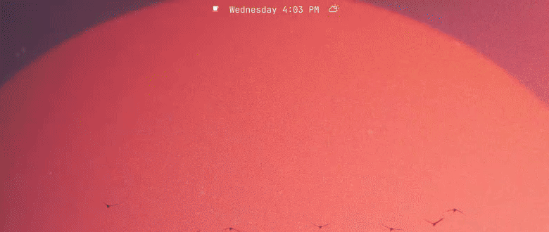
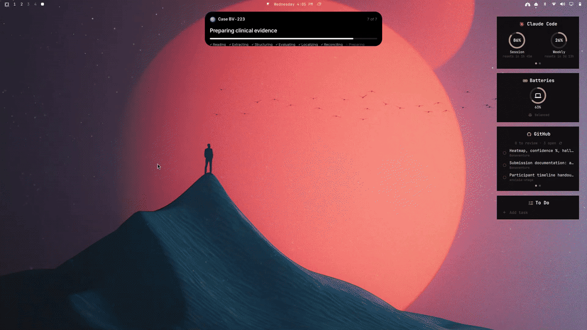
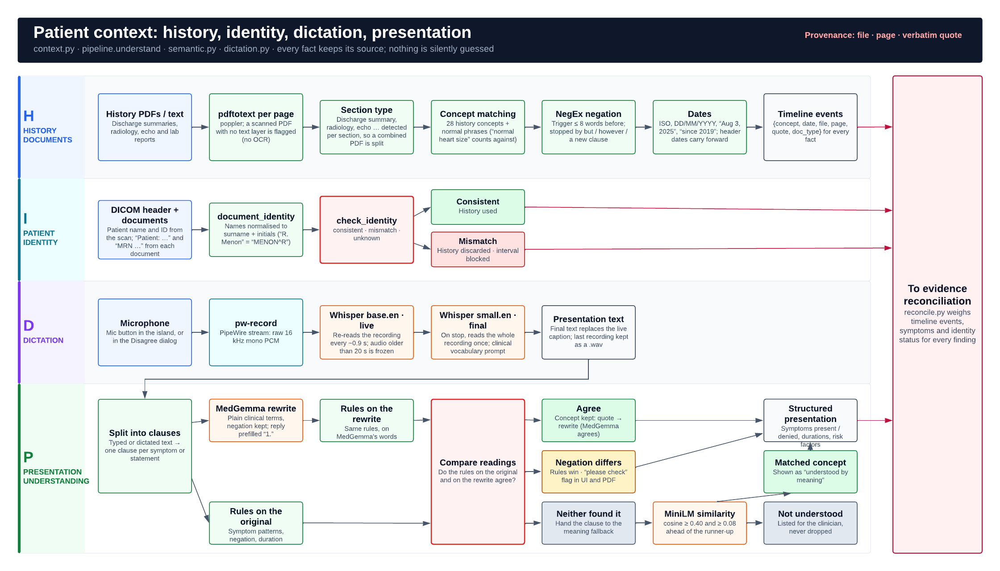
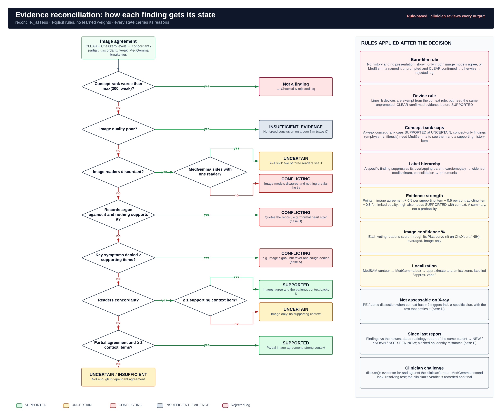
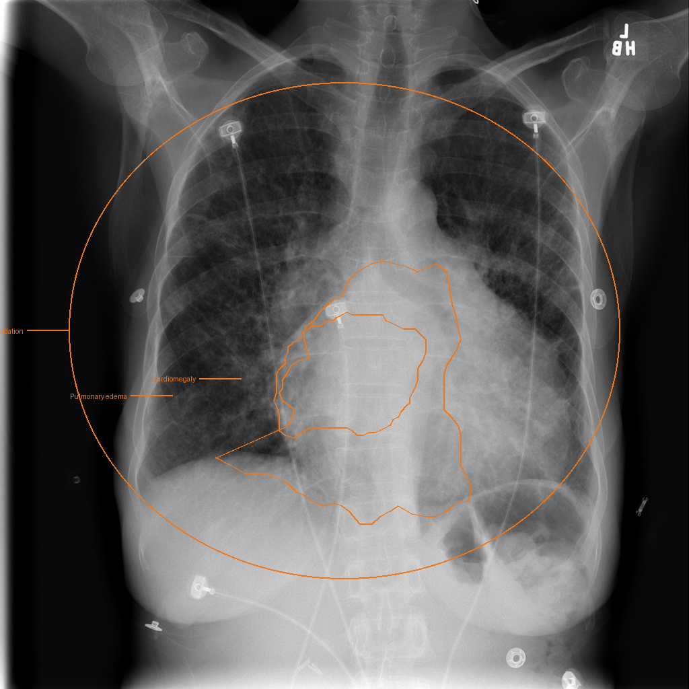
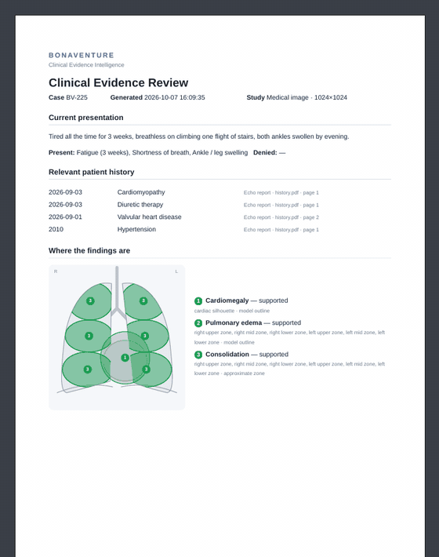

# Bonaventure — Clinical Evidence Intelligence

> **macOS branch:** this checkout is for macOS. Use [`main`](https://github.com/RM1338/Bonaventure/tree/main) for Omarchy/Linux and [`macos`](https://github.com/RM1338/Bonaventure/tree/macos) for this build. Start with the [Mac setup guide](docs/MACOS_SETUP.md), using Homebrew and pip.
>
> For a fresh Mac checkout: `git clone --branch macos https://github.com/RM1338/Bonaventure.git`. In an existing checkout, quit Bonaventure before running `git switch macos`. This branch rejects non-Mac launches before importing native GUI code. Linux/Windows setup and demo recordings retained below describe the other platform builds, not the target of this branch.
>
> After updating, quit the old instance and reinstall background startup with `.venv/bin/python scripts/install_macos.py`. Finder/login and Terminal now use the same `run.sh` environment, including Homebrew Pango paths, offline model loading and unbuffered logs. `./run.sh --check-runtime` checks the native Python runtime without opening the GUI. See the [Mac branch audit and verification steps](docs/MACOS_BRANCH_AUDIT.md).

**HackNex 2026 Internal Qualifier · HNX26PSI05: Multimodal Medical Image Intelligence**

Bonaventure is a desktop second-opinion assistant for chest X-rays. It reads the **film**, the patient's **history
documents** and the **current presentation** (typed or dictated). For every candidate finding it decides whether the
evidence **SUPPORTS** it, **CONFLICTS**, is **UNCERTAIN** or is **INSUFFICIENT**, and it shows the basis for each call:
where on the film, which document, page and quote, and which symptom. Every claim a model made that the evidence did
not back is listed under *Checked and rejected*.

> Clinical decision support: findings are presented as candidates ("Consider cardiomegaly…") for a qualified
> clinician to review. Diagnostic decisions and the final verdict remain with the clinician.

| Document | |
|---|---|
| [`docs/ARCHITECTURE.md`](docs/ARCHITECTURE.md) | System architecture as built: components, data pipeline, models, reconciliation |
| [`docs/HOW_IT_WORKS.md`](docs/HOW_IT_WORKS.md) | One real case followed from input to report, with the actual numbers |
| [`docs/PS05_CHECKLIST.md`](docs/PS05_CHECKLIST.md) | Every PS05 requirement and submission guideline, and where it is met |
| [`docs/13_MODEL_RESOURCE_REGISTER.md`](docs/13_MODEL_RESOURCE_REGISTER.md) | Declared models, datasets and libraries |
| [`docs/sample_output/`](docs/sample_output/) | Real outputs: result JSON for demo cases A–E and a normal film, PDF report, annotated film |
| [`docs/MACOS_SETUP.md`](docs/MACOS_SETUP.md) | Gavriel’s complete Homebrew/pip setup and Mac evaluation guide |
| [`docs/WINDOWS_SETUP.md`](docs/WINDOWS_SETUP.md) | Jebastin’s recorded Windows setup, dependency pins and UI verification |
| [`docs/MACOS_PR_REVIEW.md`](docs/MACOS_PR_REVIEW.md) | Review of the macOS PR, integration fixes, tests and remaining native checks |

---

## See it working

Recorded on the development laptop (Linux, Hyprland), running the real models on demo case 02 from [`demo_data/`](demo_data/).

**The island:** the pill at the top of the screen expands; the film and the history PDF are dropped in, the presentation
is typed, and *Analyse* runs the seven steps inside the island. The waiting is sped up 7×; the real case took about a minute,
including model warm-up.



**The reading room** that opens when the case is ready, with the occlusion heatmap toggled on and off (`H`):



## What it does

1. **Island launcher**: a black Dynamic-Island-style pill at the top of the screen (`Super + Alt + B` or the bar
   icon on Linux). Drop the X-ray (PNG, JPEG or DICOM) and the history PDFs, then type or
   **dictate** the presentation. Words appear live while you speak. Press *Analyse*; progress is shown inside the island.
2. **Four local models read the film.**
   * CLEAR and CheXzero score 16 findings with calibrated cut-offs.
   * CLEAR's concept bank ranks the film against 368,294 radiology-report phrases.
   * MedGemma 1.5 surveys, describes and boxes what it sees.
   * MedSAM turns each box into an outline.
3. **The patient context is read with provenance.**
   * History: dated, negation-aware facts, each with its file, page and verbatim quote.
   * Presentation: understood by MedGemma (rewritten into clinical terms) and checked by deterministic rules.
     Disagreements are flagged, and phrases nothing understood are listed instead of being guessed.
   * Patient identity is checked across all documents and the DICOM header.
4. **Reconciliation.** Explicit rules combine image agreement, history, symptoms and image quality into one evidence
   state per finding, with its reasons and an evidence strength.
5. **Reading room.** A dark review window shows the film with hand-drawn grease-pencil outlines, the findings, and for
   the selected one, what each reader said with its sources. It also shows:
   * *Since last report* (NEW / KNOWN / NOT SEEN NOW), compared with the patient's prior radiology report.
   * *Not assessable on X-ray*, e.g. pulmonary embolism, with the test that would settle it.
   * *Also seen* (verified observations outside the catalogue) and *Rejected claims*.
   * A **heatmap** for each finding (where the image reader's score comes from) and an **image confidence %**.
   * **Agree / Disagree**: a clinician who disagrees gets the evidence for and against their read, plus a second look
     from MedGemma; their verdict is recorded.
6. **PDF evidence report**: annotated film, lung diagram, per-finding evidence with sources, clinician review, rejected
   claims and limitations.

## System architecture

Five layers: inputs → desktop app → analysis core → reasoning → outputs. Everything runs locally, and the analysis core
lives apart from the window code (`desktop.Api` + `pipeline`), so only the shell is OS-specific.

The figures below document the Linux/CUDA configuration and shared reasoning.
macOS uses its own AppKit shell and ffmpeg recorder; MedGemma can use MPS/CPU.
The current presentation parser rewrites only unmatched phrases. Historical
timings in the figures are from earlier Linux runs. See the
[diagram notes](docs/DIAGRAM_NOTES.md) for these implementation details.


### Image-evidence pipeline and its hallucination checks

Every model claim has to pass an independent check. A claim that fails is not silently dropped: it goes to the
*Checked and rejected* log that the clinician can open, with who made the claim and why it was rejected.


### Patient context and presentation understanding



### Reconciliation logic



Diagrams made in [Lucidchart](https://lucid.app/lucidchart/8c67717a-b926-4130-91e5-c5ecbcc7dcfd/view). Module-level detail, the reconciliation
decision tree and the `result.json` contract are in [`docs/ARCHITECTURE.md`](docs/ARCHITECTURE.md).

## Models

All models run locally on the laptop. None was trained or fine-tuned by us; they were **calibrated** on labelled data
(see Evaluation).

| Model | What Bonaventure uses it for | Links | Licence |
|---|---|---|---|
| **CLEAR** (DINOv2 ViT-B/14 image encoder + text encoder) | Primary image reader: zero-shot score per finding from a positive / negative prompt pair | [code](https://github.com/peterhan91/CLEAR) · [weights](https://huggingface.co/peterhan91/CLEAR) | Apache-2.0 |
| **CLEAR concept bank** (368,294 report-phrase embeddings) | Ranks the film against real radiology phrases: specificity gate, third reader, quotes shown as evidence | [weights](https://huggingface.co/peterhan91/CLEAR) (`concept_embeddings_368294.pt`, `mimic_concepts.csv`) | Apache-2.0 |
| **CheXzero** (CLIP ViT-B/32 trained on MIMIC-CXR) | Independent verifier with the same prompts; occlusion heatmap | [code + weights](https://github.com/rajpurkarlab/CheXzero) | MIT |
| **MedGemma 1.5 4B-it** (4-bit NF4 on CUDA; unquantized on MPS/CPU) | Open survey of the film, per-finding visibility + observations, bounding boxes, clinical rewrite of the presentation, second look when a clinician disagrees | [Hugging Face](https://huggingface.co/google/medgemma-1.5-4b-it) | Health AI Developer Foundations terms |
| **MedSAM** (SAM ViT-B, medical) | Turns each box into an outline | [code + weights](https://github.com/bowang-lab/MedSAM) | Apache-2.0 |
| **DINOv2** (code only) | Backbone architecture loaded by CLEAR | [code](https://github.com/facebookresearch/dinov2) | Apache-2.0 |
| **Whisper base.en** | Live dictation captions | [Hugging Face](https://huggingface.co/openai/whisper-base.en) | MIT |
| **Whisper small.en** | Final dictation transcript | [Hugging Face](https://huggingface.co/openai/whisper-small.en) | MIT |
| **all-MiniLM-L6-v2** | Meaning-based fallback for presentation phrases no rule recognises | [Hugging Face](https://huggingface.co/sentence-transformers/all-MiniLM-L6-v2) | Apache-2.0 |

## Datasets

No dataset was used for training. The datasets below were used **only** to evaluate and calibrate the readers, to audit
hallucinations, and to build the demo data.

| Dataset | Used for | Where we pulled it from | Licence |
|---|---|---|---|
| **CheXpert v1.0** (validation split, 202 frontal films, radiologist consensus labels) | AUROC and calibration of CLEAR and CheXzero for 8 findings; confidence % (Platt scaling) | [danjacobellis/chexpert](https://huggingface.co/datasets/danjacobellis/chexpert) on Hugging Face · original: [Stanford ML Group](https://stanfordmlgroup.github.io/competitions/chexpert/) | Stanford CheXpert Research Use Agreement: **not redistributed here**, only the derived numbers |
| **NIH ChestX-ray14** (test split, 2 shards; NLP-mined labels) | Calibration of pneumonia, nodule, mass, emphysema, fibrosis, pleural thickening, hernia; the 36-film hallucination audit; **the 14 demo-data films** | [timm/nih-chest-xray-14](https://huggingface.co/datasets/timm/nih-chest-xray-14) on Hugging Face · original: [NIH Clinical Center](https://nihcc.app.box.com/v/ChestXray-NIHCC) (Wang et al., CVPR 2017) | No restrictions (NIH Clinical Center) |
| **MIMIC-CXR report phrases** | Inside the CLEAR concept bank (phrases only, as released by CLEAR) | via [CLEAR](https://huggingface.co/peterhan91/CLEAR) | as released by CLEAR |
| **Wikimedia Commons** CC0 radiographs | The acceptance cases A–E in `sample_data/` | [Kerley B lines](https://commons.wikimedia.org/wiki/File:Chest_radiograph_of_a_lung_with_Kerley_B_lines.jpg), [normal PA](https://commons.wikimedia.org/wiki/File:Normal_posteroanterior_(PA)_chest_radiograph_(X-ray).jpg), [PA 3-8-2010](https://commons.wikimedia.org/wiki/File:Chest_Xray_PA_3-8-2010.png) | CC0 |

All patient histories and presentations in this repository are **fictional**.

## Technologies and libraries

| Layer | Used |
|---|---|
| Runtime | Python 3.12+ (Windows setup uses 3.11), PyTorch 2.11 (CUDA 12.8 on Linux/Windows; MPS/CPU on macOS), transformers 5.19, accelerate; bitsandbytes 0.50 for CUDA |
| Desktop | pywebview 6.2 on WebKitGTK (Linux) or Cocoa/WebKit through PyObjC (macOS), WebView2 (Windows), HTML/CSS/JS UI; separate native shells |
| Documents | Poppler or pypdf for history; WeasyPrint (Linux/macOS) or Edge (Windows) for PDF reports; pydicom, Pillow, NumPy |
| Audio | PipeWire `pw-record` on Linux; ffmpeg/AVFoundation on macOS |
| Evaluation | scikit-learn (ROC, AUROC, logistic calibration), pandas (parquet datasets) |

Everything runs **locally and offline**. No external API is called and no patient data leaves the machine. Versions and
licences: [`docs/13_MODEL_RESOURCE_REGISTER.md`](docs/13_MODEL_RESOURCE_REGISTER.md).

---

## Install

Clone the repository and run the following commands from its root. Keep a separate
`.venv` on each machine, using the dependencies for its operating system.
[`requirements.txt`](requirements.txt) contains shared package versions;
[`requirements-linux.txt`](requirements-linux.txt) adds CUDA quantization, while
[`requirements-macos.txt`](requirements-macos.txt) installs the shared stack for Apple MPS/CPU.
[`requirements-windows.txt`](requirements-windows.txt) preserves the Python 3.11 package versions
recorded on Jebastin’s Windows machine. The complete dependency versions are listed below;
all installation and model-preparation commands are included in this README.
pywebview supplies its macOS PyObjC dependencies automatically.

```bash
git clone https://github.com/RM1338/Bonaventure.git
cd Bonaventure
```

> **Branch-policy clarification:** the next paragraph describes the former combined branch. Under the current split, `main` is Omarchy/Linux and `macos` is the Mac implementation. Select `macos` explicitly when following the Mac instructions.

Linux, macOS and Windows desktop shells are included on `main`. The complete
[macOS setup and evaluation guide](docs/MACOS_SETUP.md) is also available.

### Linux (tested: Arch / Omarchy + Hyprland, RTX 3050 6 GB)

This follows the original Omarchy setup documented at `769bdad`, using `uv` and
the system Python so GTK bindings remain available. The development environment
is Python **3.14.7**, created by uv **0.12.22** with
`include-system-site-packages = true`; its torch/torchvision are
**2.11.0+cu128 / 0.26.0+cu128**. The requirements filename below is the new
Linux entry point; it includes the original shared pins plus bitsandbytes.

```bash
sudo pacman -S --needed webkit2gtk-4.1 python-gobject poppler pipewire
uv venv --python /usr/bin/python3 --system-site-packages .venv          # system site-packages for the GTK bindings
uv pip install --python .venv/bin/python torch torchvision --index-url https://download.pytorch.org/whl/cu128
uv pip install --python .venv/bin/python -r requirements-linux.txt
.venv/bin/python scripts/check_setup.py --mock
```

`uv` and `xdg-open` are already available on the development Omarchy machine.
If absent on a fresh Arch install, add them with
`sudo pacman -S --needed git uv xdg-utils`. To install exactly the demonstrated
CUDA wheel versions, replace `torch torchvision` above with
`torch==2.11.0 torchvision==0.26.0`.

This is the tested Arch/Omarchy setup. Other Linux distributions need equivalent
GTK/WebKit, Poppler, PipeWire and document-viewer packages. Configure
`scripts/bonaventure-toggle` as a shortcut or bar action; Super + Alt + B is an
example binding, not an automatically registered shortcut.

### macOS (Homebrew Python 3.12, Apple MPS/CPU)

Use Gavriel's [PR #7 Homebrew + pip setup](https://github.com/RM1338/Bonaventure/pull/7).
The commands below follow its explicit Homebrew interpreter selection, rather
than assuming `python3.12` is on `PATH`. `requirements-macos.txt` includes the
same shared package pins as the guide's `requirements.txt`; Linux-only
bitsandbytes is excluded. Install [Homebrew](https://brew.sh/) first, then:

```bash
brew install git python@3.12 pango poppler ffmpeg
BONAVENTURE_PYTHON="$(brew --prefix python@3.12)/bin/python3.12"
"$BONAVENTURE_PYTHON" -m venv .venv
.venv/bin/python -m pip install --upgrade pip
.venv/bin/python -m pip install -r requirements-macos.txt
.venv/bin/python --version
export DYLD_FALLBACK_LIBRARY_PATH="$(brew --prefix)/lib${DYLD_FALLBACK_LIBRARY_PATH:+:$DYLD_FALLBACK_LIBRARY_PATH}"
.venv/bin/python scripts/check_setup.py --mock
BV_MOCK=1 BV_START=expand ./run.sh
```

For an existing checkout, keep a working `.venv` and skip creating it. If it
points to an unavailable Xcode Python shim, rename it as a backup before creating
one with the explicit Homebrew Python above. Install packages inside the venv;
avoid system-wide `pip3` and `--break-system-packages`.

The last command checks the UI with synthetic output. Quit that instance before
starting real inference. Use Option + Command + B, the menu bar icon, or hover
below the notch. Clicking/typing pins intake open; Escape and the hide button
hide the launcher while preserving progress. File pickers appear above it.

The pinned PyTorch packages are installed from the default package index on
macOS ([PyTorch installation](https://pytorch.org/get-started/locally/)); do not
use the Linux CUDA index. MedGemma selects Apple MPS when available, otherwise
CPU. MPS uses bfloat16 where supported, otherwise float32, with eager attention;
CUDA uses four-bit quantization. The unquantized model needs more RAM and time
than the tested RTX setup. See the startup log for the actual device/dtype.
Verification coverage: automated Linux checks exercise the Mac integration logic
with mocked platform APIs. Complete native rendering, microphone, MPS inference
and login-startup checks on the Mac selected for the demonstration.

For the optional Finder/login launcher, quit the app and run
`.venv/bin/python scripts/install_macos.py` (or add `--no-login`). It uses this
checkout and its `.venv`; keep both in place. Logs are in
`~/Library/Logs/Bonaventure/bonaventure.log`. Allow microphone access when prompted.

### Windows (PowerShell, Python 3.11, NVIDIA CUDA)

This follows the dependency versions recorded in Jebastin’s PR #9 environment:
**Python 3.11, RTX 4050 6 GB, CUDA 12.8**. Use 64-bit Python 3.11, Git,
Microsoft Edge and the Microsoft Edge WebView2 runtime. Edge supplies both the
desktop web view and local PDF export; pypdf handles history PDFs when Poppler
is absent. The commands below are for a new checkout; keep an existing working
virtual environment when using the teammate’s configured machine.

```powershell
py -3.11 -m venv .venv
.\.venv\Scripts\python.exe -m pip install --upgrade pip
.\.venv\Scripts\python.exe -m pip install torch==2.11.0 torchvision==0.26.0 --index-url https://download.pytorch.org/whl/cu128
.\.venv\Scripts\python.exe -m pip install pywebview==6.2.1 pythonnet==3.2.0 pydicom==3.0.2 pypdf==6.7.5 pillow==12.3.0 numpy==2.3.5
.\.venv\Scripts\python.exe -m pip install transformers==5.19.0 accelerate==1.15.0 bitsandbytes==0.50.2 huggingface_hub==1.33.0
.\.venv\Scripts\python.exe -m pip install ftfy==6.3.1 regex==2026.9.29 pandas==2.3.3 scikit-learn==1.8.0 scipy==1.17.1 h5py==3.15.1 tqdm==4.70.1 einops==0.8.2 sentencepiece==0.2.1 protobuf==6.33.6
.\.venv\Scripts\python.exe -c "import torch; print(torch.__version__); print('CUDA available:', torch.cuda.is_available())"
.\.venv\Scripts\python.exe scripts/check_setup.py --mock
```

The package commands above match `requirements-windows.txt`; alternatively, after
installing the CUDA wheels, use
`.\.venv\Scripts\python.exe -m pip install -r requirements-windows.txt`.
These are the versions recorded from the teammate’s working environment. A clean
installation and the merged native GUI/Edge workflow are the Windows verification
checks to complete on the demonstration machine. Linux integration checks cover
the shared pipeline, platform routing, PDF-history fallback and review navigation.

After completing the Windows model preparation below, launch from PowerShell:

```powershell
$env:BV_MEDGEMMA = (Resolve-Path 'models/medgemma-1.5-4b-it').Path
$env:HF_HUB_OFFLINE = '1'
$env:TRANSFORMERS_OFFLINE = '1'
$env:PYTHONIOENCODING = 'utf-8'
Remove-Item Env:BV_MOCK -ErrorAction SilentlyContinue
.\.venv\Scripts\python.exe -m bonaventure.app
```

Run one instance to keep GPU memory available for the models. `Ctrl+Alt+B`
shows/hides the centered launcher; Escape collapses intake. Type the presentation
on Windows; live microphone dictation is provided on Linux and macOS. Keep the
launching terminal open and use Ctrl+C there to stop the application. To reopen
a saved case, append its actual ID: `-m bonaventure.app BV-001`.

### Complete Python dependency versions

The table lists every directly pinned package in the per-OS dependency files.
Package managers also install their transitive dependencies. Linux/macOS use the
shared pins; Windows retains its recorded Python 3.11 numerical-library versions.

| Package | Linux / Omarchy | macOS | Windows |
|---|---|---|---|
| `pywebview` | 6.2.1 | 6.2.1 | 6.2.1 |
| `weasyprint` | 70.0 | 70.0 | — |
| `pydicom` | 3.0.2 | 3.0.2 | 3.0.2 |
| `pypdf` | 6.7.5 | 6.7.5 | 6.7.5 |
| `pillow` | 12.3.0 | 12.3.0 | 12.3.0 |
| `numpy` | 2.5.3 | 2.5.3 | 2.3.5 |
| `torch` | 2.11.0 | 2.11.0 | 2.11.0 |
| `torchvision` | 0.26.0 | 0.26.0 | 0.26.0 |
| `transformers` | 5.19.0 | 5.19.0 | 5.19.0 |
| `accelerate` | 1.15.0 | 1.15.0 | 1.15.0 |
| `huggingface_hub` | 1.33.0 | 1.33.0 | 1.33.0 |
| `ftfy` | 6.3.1 | 6.3.1 | 6.3.1 |
| `regex` | 2026.9.29 | 2026.9.29 | 2026.9.29 |
| `pandas` | 3.0.6 | 3.0.6 | 2.3.3 |
| `scikit-learn` | 1.9.1 | 1.9.1 | 1.8.0 |
| `scipy` | 1.18.1 | 1.18.1 | 1.17.1 |
| `h5py` | 3.16.0 | 3.16.0 | 3.15.1 |
| `tqdm` | 4.70.1 | 4.70.1 | 4.70.1 |
| `pythonnet` | — | — | 3.2.0 |
| `bitsandbytes` | 0.50.2 | — | 0.50.2 |
| `einops` | — | — | 0.8.2 |
| `sentencepiece` | — | — | 0.2.1 |
| `protobuf` | — | — | 6.33.6 |

Linux desktop bindings come from `webkit2gtk-4.1` and `python-gobject` installed
with pacman. macOS PyObjC/Cocoa/WebKit bindings are selected automatically by
pywebview; Windows uses pythonnet and WebView2. PDF rendering uses Pango/WeasyPrint
on Linux/macOS and Edge on Windows. Git and the Hugging Face `hf` command prepare
the external model code and weights in the next section.

### Models

Choose the layout for your machine. Clone each external repository once, skipping
ones already present. The resolver supports both layouts without moving files.

**Linux / Omarchy:** retain the home-directory weights and top-level code layout
from the original Linux setup:

```bash
# model code (cloned into the repo root)
git clone https://github.com/peterhan91/CLEAR
git clone https://github.com/rajpurkarlab/CheXzero
git clone https://github.com/bowang-lab/MedSAM
.venv/bin/python scripts/patch_clear_loader.py
mkdir -p CheXzero/checkpoints/chexzero_weights MedSAM/work_dir/MedSAM

# weights (MedGemma is gated: accept its licence on Hugging Face first)
.venv/bin/hf auth login
M=~/bonaventure/models
.venv/bin/hf download peterhan91/CLEAR best_model.pt concept_embeddings_368294.pt mimic_concepts.csv --local-dir "$M/clear"
.venv/bin/hf download google/medgemma-1.5-4b-it --include '*.json' --include '*.model' --include '*.safetensors' --local-dir "$M/medgemma-1.5-4b-it"
```

**macOS:** use the repo-local layout from PR #7, under `models/`, not
`models/Models/`:

```bash
mkdir -p models/CLEAR
git clone https://github.com/peterhan91/CLEAR.git models/CLEAR/code
git clone https://github.com/rajpurkarlab/CheXzero.git models/CheXzero
git clone https://github.com/bowang-lab/MedSAM.git models/MedSAM
mkdir -p models/CheXzero/checkpoints/chexzero_weights models/MedSAM/work_dir/MedSAM
.venv/bin/python scripts/patch_clear_loader.py
.venv/bin/hf download peterhan91/CLEAR best_model.pt concept_embeddings_368294.pt mimic_concepts.csv --local-dir models/CLEAR
.venv/bin/hf auth login
.venv/bin/hf download google/medgemma-1.5-4b-it --include '*.json' --include '*.txt' --include '*.model' --include '*.safetensors' --local-dir models/MedGemma
```

**Windows:** use the repo-local model layout recorded in PR #9. Run the
following in PowerShell from the repository root, with internet available.
Clone each external repository once. The CLEAR loader patch configures DINOv2
source loading for the local workflow.

```powershell
Remove-Item Env:HF_HUB_OFFLINE -ErrorAction SilentlyContinue
Remove-Item Env:TRANSFORMERS_OFFLINE -ErrorAction SilentlyContinue
git clone https://github.com/peterhan91/CLEAR.git CLEAR
git clone https://github.com/rajpurkarlab/CheXzero.git models/CheXzero
git clone https://github.com/bowang-lab/MedSAM.git models/MedSAM
New-Item -ItemType Directory -Force -Path models/clear, models/CheXzero/checkpoints/chexzero_weights, models/MedSAM/work_dir/MedSAM | Out-Null
.\.venv\Scripts\python.exe scripts/patch_clear_loader.py
.\.venv\Scripts\hf.exe auth login
.\.venv\Scripts\hf.exe download peterhan91/CLEAR best_model.pt concept_embeddings_368294.pt mimic_concepts.csv --local-dir models/clear
.\.venv\Scripts\hf.exe download google/medgemma-1.5-4b-it --local-dir models/medgemma-1.5-4b-it
.\.venv\Scripts\python.exe -c "import torch; torch.hub.load('facebookresearch/dinov2:main', 'dinov2_vitb14_reg', pretrained=False, trust_repo=True, skip_validation=True)"
```

Place the CheXzero and MedSAM checkpoints from the download table below in
`models/CheXzero/checkpoints/chexzero_weights/` and `models/MedSAM/work_dir/MedSAM/`.
Keep complete model snapshots, tokenizer assets and the DINOv2 source cache for
offline use. An existing `models/.torch-cache` DINOv2 cache from the teammate’s
setup is also detected automatically. Once all files are in place:

```powershell
.\.venv\Scripts\python.exe -m bonaventure.model_paths
.\.venv\Scripts\python.exe scripts/check_setup.py
```

Accept MedGemma's access terms on its [model page](https://huggingface.co/google/medgemma-1.5-4b-it)
before downloading, and log in locally with an authorized account.

Download these two checkpoints from the authors' releases; cloning their code
does **not** download weights:

| Checkpoint | Official download | Linux destination | macOS / Windows destination |
|---|---|---|---|
| CheXzero | [Authors' checkpoint folder](https://drive.google.com/drive/folders/1makFLiEMbSleYltaRxw81aBhEDMpVwno?usp=sharing), linked in their [README](https://github.com/rajpurkarlab/CheXzero#readme) | `CheXzero/checkpoints/chexzero_weights/best_128_0.0002_original_15000_0.859.pt` | `models/CheXzero/checkpoints/chexzero_weights/best_128_0.0002_original_15000_0.859.pt` |
| MedSAM ViT-B | [Authors' checkpoint folder](https://drive.google.com/drive/folders/1ETWmi4AiniJeWOt6HAsYgTjYv_fkgzoN?usp=drive_link), linked in their [README](https://github.com/bowang-lab/MedSAM#readme) | `MedSAM/work_dir/MedSAM/medsam_vit_b.pth` | `models/MedSAM/work_dir/MedSAM/medsam_vit_b.pth` |

Use the named CheXzero checkpoint, not a different ensemble member, to retain the
demonstrated calibration. For MedSAM use `medsam_vit_b.pth`, not the generic SAM
checkpoint. An in-repo layout (`models/CLEAR/code`, `models/CLEAR`,
`models/CheXzero`, `models/MedSAM`, `models/MedGemma`) is also found automatically.

While internet is still available, prepare the DINOv2 Torch Hub source cache as
in PR #7, without downloading separate DINOv2 weights. Then validate setup after
all checkpoints are in place:

```bash
.venv/bin/python -c 'import torch; torch.hub.load("facebookresearch/dinov2:main", "dinov2_vitb14_reg", pretrained=False, trust_repo=True, skip_validation=True)'
.venv/bin/python -m bonaventure.model_paths
.venv/bin/python scripts/check_setup.py
```

Complete the downloads and DINOv2 source cache before switching to offline
operation. The app/reproduction runner use Hugging Face offline mode.
`scripts/check_setup.py` verifies dependencies and model files; the reproduction
commands below verify inference and report generation. Native desktop checks
exercise the launcher, file pickers and microphone on each demonstration machine.

### Optional dictation and phrase matching

**Linux / Omarchy:** keep the home model paths used on the development machine:

```bash
.venv/bin/hf download openai/whisper-base.en --local-dir ~/bonaventure/models/whisper-base.en
.venv/bin/hf download openai/whisper-small.en --local-dir ~/bonaventure/models/whisper-small.en
.venv/bin/hf download sentence-transformers/all-MiniLM-L6-v2 --local-dir ~/bonaventure/models/minilm
.venv/bin/python scripts/check_setup.py --mock --voice
```

**macOS:** PR #7's Whisper downloads keep the processor/configuration files and
safetensors weights in the repo-local model directory:

```bash
.venv/bin/hf download openai/whisper-base.en --include '*.json' --include '*.txt' --include '*.safetensors' --local-dir models/whisper-base.en
.venv/bin/hf download openai/whisper-small.en --include '*.json' --include '*.txt' --include '*.safetensors' --local-dir models/whisper-small.en
.venv/bin/hf download sentence-transformers/all-MiniLM-L6-v2 --include '*.json' --include '*.txt' --include '*.safetensors' --local-dir models/minilm
.venv/bin/python scripts/check_setup.py --mock --voice
```

Existing Whisper copies under `~/bonaventure/models/` are also found. MiniLM's
default is `~/bonaventure/models/minilm`; for the repo-local download above,
start with `BV_MINILM="$PWD/models/minilm" ./run.sh`. Dictation uses PipeWire on
Linux and ffmpeg/AVFoundation on macOS. The most recent recording is kept locally
in the ignored `models/last_dictation.wav` for debugging.

## Configure

No configuration is needed for the default layout. Optional environment variables:

| Variable | Effect |
|---|---|
| `BV_MOCK=1` | Run the UI without models (clearly labelled mock output) |
| `BV_MEDGEMMA`, `BV_CLEAR_DIR`, `BV_CHEXZERO_DIR`, `BV_MEDSAM_DIR`, `BV_MODELS_DIR` | Point at model folders elsewhere |
| `BV_WHISPER`, `BV_WHISPER_LIVE`, `BV_MINILM` | Dictation / meaning-fallback model folders |
| `BV_CLIP_DEVICE=cuda` | Run CLEAR and CheXzero on the GPU (default CPU, which leaves VRAM for MedGemma + MedSAM) |
| `BV_MEDGEMMA_DEVICE=auto` | Select CUDA, then macOS MPS, then CPU; `cuda`, `mps`, or `cpu` requires that backend |
| `BV_IMAGE_GENERATION_SECONDS`, `BV_PRESENTATION_SECONDS` | Cooperative generation budgets: image default 180 s CUDA / 600 s MPS / 1800 s CPU; presentation default 30 s |
| `BV_START=expand` | Open the island expanded at launch |

The Linux shortcut and bar button only need to run `scripts/bonaventure-toggle`. This starts the app, or shows/hides the
island if it is already running.

## Run

```bash
./run.sh                    # Linux island or macOS notch launcher
BV_START=expand ./run.sh    # open intake immediately
./run.sh BV-001             # substitute a case ID created on THIS machine
scripts/bonaventure-toggle  # Linux only: show / hide the island
```

Saved cases are in `cases/BV-xxx/` (inputs, `scan.png`, `result.json`); reports go to `reports/BV-xxx.pdf`.
These directories are ignored by Git. A fresh clone has no saved BV case IDs;
generate a case first, then use the ID printed by the runner to reopen it.
On macOS exported reports open with `open`; Linux uses `xdg-open`.

---

## Demo data

[`demo_data/`](demo_data/) holds **14 demo cases, one per condition**. Each case folder has the input files and what
Bonaventure reported:

```
demo_data/02 Cardiomegaly/
  film.png           the medical image (NIH ChestX-ray14 film 00004344_013, labelled "Cardiomegaly")
  history.pdf        fictional patient record (cardiology note, echo report)
  presentation.txt   fictional current presentation, as a clinician would type or dictate it
  result.txt         what Bonaventure reported for this case
```

The films are real NIH ChestX-ray14 test-split images chosen by their dataset label
([`scripts/build_demo_library.py`](scripts/build_demo_library.py)); every film is a different image, and every patient has
a different, fictional history and presentation. To try one, drop `film.png` and `history.pdf` on the island and paste
`presentation.txt`.

### Sample input and output: demo case 02 (cardiomegaly)

**Input:**
* `film.png`: NIH film labelled *Cardiomegaly*.
* `history.pdf`: *"Dilated cardiomyopathy, LVEF 30 %. Hypertension since 2010."*; furosemide; echo with moderate
  mitral regurgitation.
* Presentation: *"Tired all the time for 3 weeks, breathless on climbing one flight of stairs, both ankles swollen by
  evening."*

**Output** ([result JSON](docs/sample_output/demo02_cardiomegaly_result.json) · [PDF report](docs/sample_output/demo02_cardiomegaly_report.pdf)):



| Finding | State | Strength · image confidence | Evidence shown to the clinician |
|---|---|---|---|
| Cardiomegaly | **SUPPORTED** | high · 96 % (CLEAR 99, CheXzero 94) | MedGemma: "The heart appears enlarged, with a prominent cardiac silhouette"; MedSAM outline of the heart; echo report p.1 "Dilated cardiomyopathy, LVEF 30%"; fatigue for 3 weeks, breathlessness, ankle swelling |
| Pulmonary edema | **SUPPORTED** | high · 82 % (CLEAR 92, CheXzero 73) | MedGemma: "increased opacity in the lung fields, suggestive of pulmonary edema"; furosemide in the record; breathlessness, ankle swelling |
| Consolidation | **SUPPORTED** | high · 32 % (CLEAR 48, CheXzero 17) | Both readers pass their cut-offs and breathlessness supports it, so the rule-based state is SUPPORTED. The 32 % image confidence and MedGemma not confirming it are shown alongside, and it is drawn as an approximate zone, so the clinician can weigh it. See Scope and safeguards |

**The exported PDF evidence report** for this case (*Export report* in the reading room), scrolled from the presentation
and lung diagram through each finding's evidence:



* 10 model claims were checked and rejected, e.g. "right-sided central venous catheter" and "left lower lobe opacity"
  (MedGemma's survey; CLEAR did not confirm them).

### All 14 demo cases (current code)

| Case | What Bonaventure reports (state, strength, image confidence) |
|---|---|
| 01 Pleural effusion | Pleural effusion: SUPPORTED (high, image confidence 98 %); Consolidation: SUPPORTED (high, image confidence 84 %); Pleural thickening: SUPPORTED (high, image confidence 28 %); Atelectasis: SUPPORTED (moderate, image confidence 62 %); Cardiomegaly: SUPPORTED (high, image confidence 54 %); Pulmonary edema: UNCERTAIN (moderate, image confidence 74 %) |
| 02 Cardiomegaly | Cardiomegaly: SUPPORTED (high, image confidence 96 %); Pulmonary edema: SUPPORTED (high, image confidence 82 %); Consolidation: SUPPORTED (high, image confidence 32 %) |
| 03 Pulmonary edema | Pulmonary edema: SUPPORTED (high, image confidence 94 %); Consolidation: SUPPORTED (high, image confidence 48 %); Cardiomegaly: SUPPORTED (high, image confidence 92 %); Atelectasis: UNCERTAIN (low, image confidence 49 %) |
| 04 Pneumonia | Pleural effusion: SUPPORTED (high, image confidence 98 %); Consolidation: SUPPORTED (high, image confidence 84 %); Pulmonary edema: UNCERTAIN (moderate, image confidence 60 %); Atelectasis: UNCERTAIN (moderate, image confidence 66 %); Pleural thickening: UNCERTAIN (low, image confidence 38 %); Lines & devices: UNCERTAIN (moderate, image confidence 56 %); Cardiomegaly: UNCERTAIN (moderate, image confidence 79 %) |
| 05 Atelectasis | Atelectasis: SUPPORTED (high, image confidence 86 %); Widened mediastinum: CONFLICTING (low, image confidence 52 %) |
| 06 Pneumothorax | Cardiomegaly: SUPPORTED (high, image confidence 32 %); Lines & devices: UNCERTAIN (low, image confidence 38 %); Pneumothorax: UNCERTAIN (moderate, image confidence 53 %); Atelectasis: UNCERTAIN (moderate, image confidence 75 %); Pleural effusion: UNCERTAIN (moderate, image confidence 64 %) |
| 07 Lung mass | Widened mediastinum: CONFLICTING (low, image confidence 45 %); Consolidation: UNCERTAIN (moderate, image confidence 20 %); Lines & devices: UNCERTAIN (low, image confidence 32 %); Atelectasis: UNCERTAIN (moderate, image confidence 43 %); Also seen: Right upper lobe opacity; Also seen: Right lower lobe opacity |
| 08 Emphysema | Emphysema: SUPPORTED (high); Atelectasis: UNCERTAIN (moderate, image confidence 34 %) |
| 09 Pulmonary fibrosis | Pulmonary fibrosis: SUPPORTED (high); Cardiomegaly: SUPPORTED (high, image confidence 56 %); Consolidation: UNCERTAIN (moderate, image confidence 49 %); Pulmonary edema: UNCERTAIN (moderate, image confidence 70 %) |
| 10 Pleural thickening | Pleural thickening: SUPPORTED (high, image confidence 44 %); Pleural effusion: SUPPORTED (high, image confidence 98 %); Atelectasis: SUPPORTED (high, image confidence 59 %); Cardiomegaly: SUPPORTED (high, image confidence 38 %); Consolidation: CONFLICTING (moderate, image confidence 54 %); Pulmonary edema: UNCERTAIN (low, image confidence 22 %); Also seen: Right lung opacity; Also seen: Elevated right hemidiaphragm |
| 11 Hiatus hernia | Hiatus hernia: SUPPORTED (high, image confidence 70 %); Cardiomegaly: SUPPORTED (high, image confidence 61 %); Pleural thickening: SUPPORTED (moderate, image confidence 25 %); Atelectasis: INSUFFICIENT_EVIDENCE (low, image confidence 30 %); Lines & devices: INSUFFICIENT_EVIDENCE (low, image confidence 38 %) |
| 12 Lines and devices | Cardiomegaly: UNCERTAIN (moderate, image confidence 96 %); Pulmonary edema: UNCERTAIN (moderate, image confidence 64 %); Pleural effusion: UNCERTAIN (moderate, image confidence 58 %); Lines & devices: UNCERTAIN (moderate, image confidence 74 %); Atelectasis: UNCERTAIN (low, image confidence 44 %) |
| 13 Normal | No findings |
| 14 Pulmonary embolism (not on X-ray) | Not assessable on X-ray: Pulmonary embolism |

These reference outputs show how the system handles a range of evidence strengths.
Of the 12 cases with a condition visible on X-ray, 11 raise the labelled condition:
pneumonia (04) appears as consolidation, while pneumothorax (06) and devices (12)
are presented as *uncertain*. The labelled mass in case 07 is not raised; that case
shows the current detection boundary and other reported observations. Some films
produce additional candidate findings, each with its evidence state for review.
The normal film (13) produces no findings; case 14 presents pulmonary embolism
as *not assessable on X-ray*, directing review toward the appropriate modality.
Use the reproduction commands below to generate fresh outputs alongside these
committed references.

### Acceptance cases A–E

[`sample_data/`](sample_data/) holds five scripted acceptance cases on CC0 Wikimedia films. They test the reasoning rather
than the image models: the same film with agreeing vs. contradicting history (A/B), a degraded image (C), a condition an
X-ray cannot show (D), and records from two different patients (E). Their outputs are in
[`docs/sample_output/`](docs/sample_output/), and case A is followed step by step in [`docs/HOW_IT_WORKS.md`](docs/HOW_IT_WORKS.md).

## Reproduce the demonstrated results

Both suites use files already committed in this repository; no dataset download
is needed to reproduce them. Complete the OS setup and model downloads above,
quit any running Bonaventure instance to release model memory, and run commands
from the repository root. **Real inference is the default.**

List cases or check their inputs without loading models:

```bash
.venv/bin/python scripts/reproduce.py --suite library --list
.venv/bin/python scripts/reproduce.py --suite acceptance --list
.venv/bin/python scripts/reproduce.py --suite library --check-inputs
.venv/bin/python scripts/reproduce.py --suite acceptance --check-inputs
```

Reproduce the cardiomegaly example used in the GIFs, with a fresh PDF:

```bash
.venv/bin/python scripts/reproduce.py --suite library --case 02 --pdf
```

The terminal prints its new `BV-xxx` ID and output directory. Open that case with
`./run.sh BV-xxx`. Compare the fresh result to
[`demo02_cardiomegaly_result.json`](docs/sample_output/demo02_cardiomegaly_result.json)
and the [committed PDF](docs/sample_output/demo02_cardiomegaly_report.pdf).

Run all 14 library cases, all seven acceptance cases, or just the same-film
agreement/contradiction pair:

```bash
.venv/bin/python scripts/reproduce.py --suite library --pdf
.venv/bin/python scripts/reproduce.py --suite acceptance --pdf
.venv/bin/python scripts/reproduce.py --suite acceptance --case A --case B --pdf
```

Each invocation creates a new `cases/demo-runs/<UTC timestamp>/` directory:

```text
manifest.json           mode, commit, OS, package versions, input SHA-256 hashes,
                        presentation, model status, BV IDs and finding summaries
02/result.json          full evidence, confidence, provenance and intermediate outputs
02/progress.json        case state and stage progress
02/report.pdf           if --pdf was requested
02/error.json           if that case or report export failed
```

Acceptance output folders use `A`, `B`, etc. Full saved cases remain in
`cases/BV-xxx/` and canonical PDFs in `reports/`. The runner does not replace any
committed `demo_data/result.txt` or `docs/sample_output/` file. It exits nonzero
on missing inputs/models, timeout, failed analysis or PDF export. All four image
models plus the concept bank must load for a real reproduction; the runner
refuses automatic fallback to mock output.

For a pipeline/report check without model weights, explicitly add `--mock`:

```bash
.venv/bin/python scripts/reproduce.py --suite library --case 02 --mock --pdf
```

Its manifest is labelled `mode: mock`: this mode validates the UI, orchestration
and report flow using synthetic output. Real-model evaluation uses the default
mode with `BV_MOCK` unset. Runtime is specific to the hardware and backend; record
timing on the demonstration machine. Compare evidence states, citations and
confidence values across runs, allowing for backend-dependent wording and case IDs.

The older `scripts/run_demo_cases.py` still runs A–E plus two normals.
`scripts/run_demo_library.py` overwrites the library's committed summaries;
use `scripts/reproduce.py` for submission reproduction.

**Windows reproduction (PowerShell):** use the same suites and case keys with
the Windows virtual-environment interpreter. Run one Bonaventure process at a time
so the models have the GPU memory available.

```powershell
.\.venv\Scripts\python.exe scripts/reproduce.py --suite library --list
.\.venv\Scripts\python.exe scripts/reproduce.py --suite library --case 02 --pdf
.\.venv\Scripts\python.exe scripts/reproduce.py --suite acceptance --pdf
.\.venv\Scripts\python.exe -m unittest discover -s tests -v
.\.venv\Scripts\python.exe -m scripts.verify_windows_pipeline
```

The final command opens the Windows desktop and exercises file attachment,
analysis and review on three sample scenarios, then records its checks in
`reports/pipeline-acceptance-verification.json`. PDF export is exercised by the
`--pdf` reproduction commands. The full library can be run by omitting `--case 02`.

Self-tests and desktop regressions:

```bash
.venv/bin/python -m bonaventure.context
.venv/bin/python -m bonaventure.reconcile
.venv/bin/python -c 'from bonaventure import models; models._selftest()'
.venv/bin/python -m unittest discover -s tests -v
node --test tests/*.test.cjs
```

Node is an optional development dependency for JavaScript regression tests:
install it with `sudo pacman -S --needed nodejs` on Omarchy, `brew install node`
on macOS, or `winget install --id OpenJS.NodeJS.LTS -e` on Windows. The app and
demo runner use Python. For per-model runtime
diagnostics, run `.venv/bin/python scripts/diagnose_models.py`; on slow CPU use
`--timeout 2400`. Optional Whisper checkpoints must be installed for those voice
checks. See [`docs/DESKTOP_VERIFICATION.md`](docs/DESKTOP_VERIFICATION.md) for native checks.

| Case | Input | Expected result |
|---|---|---|
| A · agreement | Kerley-B film + heart-failure history + breathlessness, orthopnea | Cardiomegaly and edema **SUPPORTED · high**, localized; consolidation **CONFLICTING** (fever and cough denied) |
| B · contradiction | *Same film* + a history whose recent report reads "normal heart size, lungs clear" | Everything **CONFLICTING**, quoting the report; since last report: **NEW** |
| C · poor image | Degraded film | **INSUFFICIENT_EVIDENCE**: no forced conclusion |
| D · not on X-ray | Normal film + post-op knee replacement, pleuritic pain, racing heart, calf swelling | No image finding; **pulmonary embolism: not assessable on a chest X-ray**, with Wells/D-dimer/CTPA advice |
| E · wrong patient | Records from two different patients | **Identity mismatch**: history not used, interval comparison blocked |
| N, N2 · normal | Two normal films | No findings |

Real outputs of these runs are in [`docs/sample_output/`](docs/sample_output/).

Calibration and audit (needs the datasets, see the register):

```bash
PYTHONPATH=. .venv/bin/python scripts/calibrate.py      # → bonaventure/calibration.json
PYTHONPATH=. .venv/bin/python scripts/eval_concepts.py  # → bonaventure/concept_calibration.json
PYTHONPATH=. .venv/bin/python scripts/audit.py          # → bonaventure/audit.json (36 unseen NIH films)
```

## Evaluation

For each finding and reader, AUROC on labelled films and three cut-offs read off the ROC curve: *weak* = 90 %
sensitivity, *moderate* = Youden's J, *strong* = 90 % specificity. **A reader only votes where AUROC ≥ 0.70.**

| Finding | Source (positives) | CLEAR | CheXzero | Both | Votes |
|---|---|---|---|---|---|
| Pleural effusion | CheXpert (64+) | 0.909 | 0.884 | 0.904 | CLEAR + CheXzero |
| Cardiomegaly | CheXpert (66+) | 0.848 | 0.825 | 0.843 | CLEAR + CheXzero |
| Pulmonary edema | CheXpert (42+) | 0.912 | 0.906 | 0.935 | CLEAR + CheXzero |
| Consolidation | CheXpert (32+) | 0.901 | 0.851 | 0.897 | CLEAR + CheXzero |
| Atelectasis | CheXpert (75+) | 0.814 | 0.786 | 0.817 | CLEAR + CheXzero |
| Pneumothorax | CheXpert (7+) | 0.785 | 0.763 | 0.800 | CLEAR + CheXzero (hand-set cut-offs: too few positives) |
| Widened mediastinum | CheXpert (105+) | 0.880 | 0.877 | 0.900 | CLEAR + CheXzero |
| Lines & devices | CheXpert (99+) | 0.736 | 0.730 | 0.755 | CLEAR + CheXzero |
| Pleural thickening | NIH (85+) | 0.699 | 0.730 | 0.734 | CheXzero |
| Pneumonia | NIH (60+) | 0.724 | 0.689 | 0.715 | CLEAR |
| Hiatus hernia | NIH (30+) | 0.531 | 0.859 | 0.724 | CheXzero |
| Emphysema / fibrosis | NIH (68+ each) | 0.63 | 0.55 | — | concept bank (AUROC 0.829 / 0.768) + MedGemma + history |
| Lung mass / nodule | NIH (79+ / 82+) | 0.67 / 0.54 | 0.62 / 0.51 | — | none: only via the MedGemma survey, verified by CLEAR |
| Rib fracture | — | — | — | — | no labels: never raised by the image models |

**Hallucination audit** (`scripts/audit.py`, full pipeline on 36 NIH films not used for calibration, film only, no
history):

| | Result |
|---|---|
| Normal films with a **SUPPORTED** finding | **1 / 12** (a "lines & devices" false positive; see the checklist) |
| Normal films with any UNCERTAIN / CONFLICTING item | 9 / 12: never presented as supported, each says "no supporting clinical context" |
| Normal films with an "also seen" observation | 3 / 12 |
| Diseased films where the labelled disease was raised | **10 / 24**: cardiomegaly 2/2, edema 2/2, consolidation 2/2, atelectasis 2/2, effusion 1/2, pleural thickening 1/2; 0/2 for pneumothorax, pneumonia, mass, nodule, emphysema, fibrosis (the last two need a supporting history, and the audit supplies none) |
| Model claims removed by the cross-checks | 193 (all listed per case under *Checked and rejected*) |

This audit isolates image-model behaviour by supplying films without history or
presentation. It complements the multimodal demonstrations, which also use
patient context.
These numbers are from before the final bare-film rule (a finding on a film with no context must be seen by both image
models, or named by MedGemma unprompted and confirmed by CLEAR; devices need that same evidence). A re-check of the same
12 normal films after it: **no SUPPORTED and no CONFLICTING item on any of them**, 5 / 12 completely clean. The full
36-film table records the earlier rule version; post-change verification covers
those 12 normal films and cases A–E, whose results were unchanged.

---

## Scope note

| Minimum viable solution (implemented, demonstrated) | Stretch goals |
|---|---|
| Chest X-ray input (PNG/JPEG/DICOM) with a quality gate | **Implemented:** MedSAM segmentation outlines; open-ended "also seen" survey; dictation with live captions; LLM understanding of free-text presentations; patient identity check; "since last report"; clinician challenge + second look; rejected-claims log; lung diagram in the report; separate macOS and Windows shells (native checks on the target demonstration machines) |
| Multi-model image reading with calibrated levels and confidence %, localization (box/outline/zone), occlusion heatmap | **Future extensions:** CT / MRI, OCR for scanned history PDFs, trained classifiers, and expanded validation for nodule / mass / pneumothorax detection |
| History parsing with negation, dates and page-level provenance | |
| Evidence reconciliation → SUPPORTED / UNCERTAIN / CONFLICTING / INSUFFICIENT with reasons | |
| Desktop review UI and PDF evidence report | |

## Scope and safeguards

Bonaventure is built to say how sure it is and where its evidence ends. Each boundary below comes with the mechanism that
handles it.

| Area | Current scope | How Bonaventure handles it | Next step |
|---|---|---|---|
| Imaging | Frontal chest X-rays (PNG, JPEG, DICOM); 16 catalogue findings, 11 with a calibrated reader at AUROC 0.72–0.94 | Findings without a reliable reader are never raised from the pixels alone. MedGemma's unprompted survey can still surface them as *also seen*, but only when CLEAR independently confirms them | CT / MRI support; more sensitivity for nodules, masses and pneumothorax |
| Confidence | Calibrated image confidence % per finding and per reader (Platt scaling on CheXpert / NIH films) | The percentage describes the image only. The patient's history and symptoms are weighed separately in the evidence state, so neither can hide the other | Re-calibrate on local data before clinical use, where prevalence differs |
| Calibration data | 202 radiologist-labelled CheXpert films and an NIH ChestX-ray14 sample | Findings with too few positives (pneumothorax: 7) keep stricter hand-set thresholds instead of a fragile ROC point | Larger labelled validation sets |
| Localization | MedSAM outlines from MedGemma boxes | Every box must sit where the model's own words place it, and every mask must fit its box. If either fails, an anatomical zone is shown and labelled *approx. zone* | Dedicated detection models for finer boxes |
| Patient context | PDF / text histories with page-level citations; typed or dictated presentations | Negation and dates are handled per sentence. Phrases the rules do not recognise are rewritten by MedGemma and re-checked; anything still unclear is listed as *not understood*, never guessed. Records from two different patients are detected and set aside | OCR for scanned documents |

* **Platform verification:** the integrated version has 111 passing Python tests,
  three passing JavaScript test files, and a real Linux/CUDA inference and PDF run.
  Native macOS and Windows GUI/backend checks are to be completed on those target
  machines; Windows clean-install validation also remains part of that process.

## Repository

```
bonaventure/
  app.py            entry point (dispatches to Linux, macOS or Windows)
  desktop.py        shared UI bridge (intake, analysis, review, challenge, dictation, export)
  windows_app.py    Windows shell: centered launcher and Ctrl+Alt+B shortcut
  linux_app.py      Linux shell: Hyprland island placement, GTK drag-and-drop
  macos_app.py      macOS shell: notch placement, menu bar, picker and shortcut
  pipeline.py       case orchestration, progress, presentation understanding
  imaging.py        scan loading (PNG/JPEG/DICOM), quality gate, model engine (+ mock)
  models.py         CLEAR, concept bank, CheXzero, MedGemma, MedSAM; image-evidence stage
  context.py        history + presentation parsing (negation, dates, durations, provenance, identity)
  semantic.py       MiniLM meaning fallback
  reconcile.py      evidence reconciliation, interval change, not-assessable, challenge discussion
  knowledge.py      clinical vocabulary, findings, anatomical zones
  report.py         PDF evidence report, lung diagram
  dictation.py      offline Whisper dictation with live captions
  model_paths.py    model locations (both layouts, env overrides)
  calibration.json, concept_calibration.json, audit.json
  ui/               island.html (launcher), review.html (reading room), fonts
scripts/            calibration, audit, demo cases, demo library, setup checks, toggle
demo_data/          14 demo cases (NIH films + fictional histories, presentations, results)
sample_data/        acceptance cases A–E (CC0 films, fictional histories)
docs/               architecture, walkthrough, PS05 checklist, sample outputs, diagrams, GIFs, planning docs, model register
```

## Original contribution vs. external components

**Original:** the workflow and product; the evidence-reconciliation engine and all its rules; per-reader calibration
and the concept-rank specificity gate; the cross-checks between models (survey verified by CLEAR, box vs region,
mask vs box); history parsing with provenance; the presentation-understanding layers; the identity check; interval
change; not-assessable advisories; clinician challenge; the rejected-claims log; the island and reading-room UI; the
PDF report.

**External** (declared in the register): CLEAR and its concept bank, CheXzero, MedGemma 1.5, MedSAM, Whisper, MiniLM,
DINOv2 code, open-source libraries, the CheXpert and NIH datasets (calibration and evaluation only, nothing trained),
and CC0 demo films.
