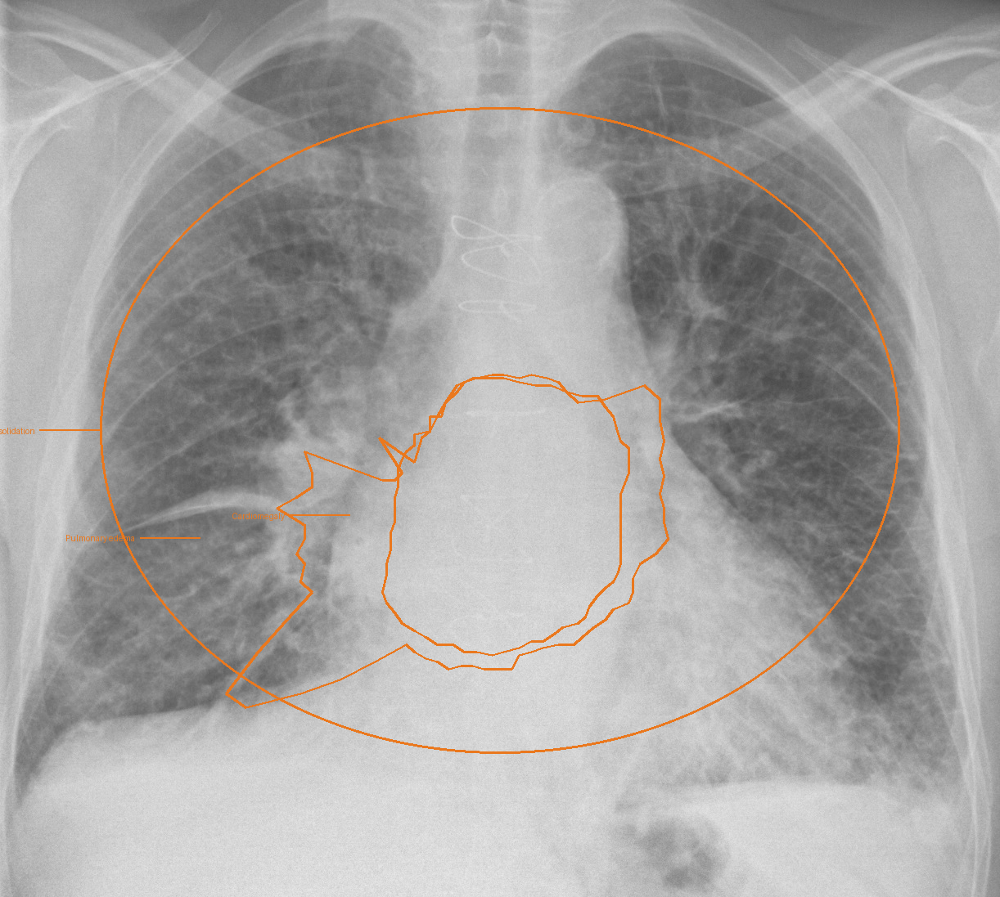

# Bonaventure — Clinical Evidence Intelligence

**HackNex 2026 Internal Qualifier · HNX26PSI05: Multimodal Medical Image Intelligence**

Bonaventure is a desktop second-opinion assistant for chest X-rays. It reads the **film**, the patient's **history
documents** and the **current presentation** (typed or dictated). For every candidate finding it decides whether the
evidence **SUPPORTS** it, **CONFLICTS**, is **UNCERTAIN** or is **INSUFFICIENT**, and it shows the basis for each call:
where on the film, which document, page and quote, and which symptom. Every claim a model made that the evidence did
not back is listed under *Checked and rejected*.

> Decision support only. Not a diagnosis. It speaks as a helper ("Consider cardiomegaly…"); a qualified clinician
> reviews every output and their verdict is final.

| Document | |
|---|---|
| [`docs/ARCHITECTURE.md`](docs/ARCHITECTURE.md) | System architecture as built: components, data pipeline, models, reconciliation |
| [`docs/HOW_IT_WORKS.md`](docs/HOW_IT_WORKS.md) | One real case followed from input to report, with the actual numbers |
| [`docs/PS05_CHECKLIST.md`](docs/PS05_CHECKLIST.md) | Every PS05 requirement and submission guideline, and where it is met |
| [`docs/13_MODEL_RESOURCE_REGISTER.md`](docs/13_MODEL_RESOURCE_REGISTER.md) | Declared models, datasets and libraries |
| [`docs/sample_output/`](docs/sample_output/) | Real outputs: result JSON for demo cases A–E and a normal film, PDF report, annotated film |

---

## What it does

1. **Island launcher**: a black Dynamic-Island-style pill at the top of the screen (`Super + Alt + B` or the bar
   icon on Linux, `⌥⌘B` / notch on macOS). Drop the X-ray (PNG, JPEG or DICOM) and the history PDFs, then type or
   **dictate** the presentation. Words appear live while you speak. Press *Analyse*; progress is shown inside the island.
2. **Four local models read the film.**
   * CLEAR and CheXzero score 16 findings with calibrated cut-offs.
   * CLEAR's concept bank ranks the film against 368,294 radiology-report phrases.
   * MedGemma 1.5 surveys, describes and boxes what it sees.
   * MedSAM turns each box into an outline.
3. **The patient context is read with provenance.**
   * History: dated, negation-aware facts, each with its file, page and verbatim quote.
   * Presentation: understood by MedGemma (rewritten into clinical terms) and checked by deterministic rules.
     Disagreements are flagged, and phrases nothing understood are listed instead of being guessed.
   * Patient identity is checked across all documents and the DICOM header.
4. **Reconciliation.** Explicit rules combine image agreement, history, symptoms and image quality into one evidence
   state per finding, with its reasons and an evidence strength.
5. **Reading room.** A dark review window shows the film with hand-drawn grease-pencil outlines, the findings, and for
   the selected one, what each reader said with its sources. It also shows:
   * *Since last report* (NEW / KNOWN / NOT SEEN NOW), compared with the patient's prior radiology report.
   * *Not assessable on X-ray*, e.g. pulmonary embolism, with the test that would settle it.
   * *Also seen* (verified observations outside the catalogue) and *Rejected claims*.
   * **Agree / Disagree**: a clinician who disagrees gets the evidence for and against their read, plus a second look
     from MedGemma; their verdict is recorded.
6. **PDF evidence report**: annotated film, lung diagram, per-finding evidence with sources, clinician review, rejected
   claims and limitations.

## Technologies, libraries and models

| Layer | Used |
|---|---|
| Image readers | **CLEAR** (DINOv2 ViT-B/14 + text encoder, Apache-2.0), **CheXzero** (CLIP ViT-B/32 on MIMIC-CXR, MIT) |
| Concept retrieval | CLEAR concept bank: 368,294 MIMIC report phrases |
| Visual reasoning | **MedGemma 1.5 4B-it**, 4-bit NF4 (Health AI Developer Foundations terms) |
| Segmentation | **MedSAM** ViT-B (Apache-2.0) |
| Speech | **Whisper** base.en (live) and small.en (final), MIT |
| Meaning fallback | **all-MiniLM-L6-v2** (Apache-2.0) |
| Runtime | Python 3.12+, PyTorch 2.11 (CUDA 12.8), transformers 5.19, bitsandbytes 0.50 |
| Desktop | pywebview 6.2 (WebKitGTK on Linux, WKWebView + PyObjC on macOS), HTML/CSS/JS UI |
| Documents | poppler `pdftotext`, WeasyPrint (PDF report), pydicom, Pillow, NumPy |
| Calibration data | CheXpert v1.0 validation (202 frontal films), NIH ChestX-ray14 test split |

Everything runs **locally and offline**. No external API is called and no patient data leaves the machine. Details,
versions and licences: [`docs/13_MODEL_RESOURCE_REGISTER.md`](docs/13_MODEL_RESOURCE_REGISTER.md).

---

## Install

### Linux (tested: Arch / Omarchy + Hyprland, RTX 3050 6 GB)

```bash
sudo pacman -S --needed webkit2gtk-4.1 python-gobject poppler pipewire   # system deps
uv venv --python /usr/bin/python3 --system-site-packages .venv          # system site-packages for the GTK bindings
uv pip install --python .venv/bin/python torch torchvision --index-url https://download.pytorch.org/whl/cu128
uv pip install --python .venv/bin/python -r requirements.txt
```

### macOS

```bash
brew install pango poppler ffmpeg
curl -LsSf https://astral.sh/uv/install.sh | sh
uv python install 3.12 && uv venv --python 3.12 --clear .venv
uv pip install --python .venv/bin/python -r requirements.txt
```

The macOS shell (notch island, menu bar) is in `bonaventure/macos_*.py`. There is no CUDA on macOS, so MedGemma runs
unquantised on the CPU and analysis is much slower.

### Models

```bash
# model code (cloned into the repo root)
git clone https://github.com/peterhan91/CLEAR
git clone https://github.com/rajpurkarlab/CheXzero     # weights → CheXzero/checkpoints/chexzero_weights/best_128_0.0002_original_15000_0.859.pt
git clone https://github.com/bowang-lab/MedSAM         # weights → MedSAM/work_dir/MedSAM/medsam_vit_b.pth

# weights (MedGemma is gated: accept the licence on Hugging Face and `hf auth login` first)
M=~/bonaventure/models
hf download peterhan91/CLEAR best_model.pt concept_embeddings_368294.pt mimic_concepts.csv --local-dir $M/clear
hf download google/medgemma-1.5-4b-it --local-dir $M/medgemma-1.5-4b-it
hf download openai/whisper-base.en  --local-dir $M/whisper-base.en         # dictation (optional)
hf download openai/whisper-small.en --local-dir $M/whisper-small.en
hf download sentence-transformers/all-MiniLM-L6-v2 --local-dir $M/minilm  # phrase fallback (optional)

.venv/bin/python -m bonaventure.model_paths   # prints every model path and whether it was found
.venv/bin/python scripts/check_setup.py       # dependency + weight check without loading the models
```

The alternative layout used by the macOS setup (`models/CLEAR`, `models/CheXzero`, `models/MedSAM`, `models/MedGemma`
inside the repo) is found automatically.

## Configure

No configuration is needed for the default layout. Optional environment variables:

| Variable | Effect |
|---|---|
| `BV_MOCK=1` | Run the UI without models (clearly labelled mock output) |
| `BV_MEDGEMMA`, `BV_CLEAR_DIR`, `BV_CHEXZERO_DIR`, `BV_MEDSAM_DIR`, `BV_MODELS_DIR` | Point at model folders elsewhere |
| `BV_WHISPER`, `BV_WHISPER_LIVE`, `BV_MINILM` | Dictation / meaning-fallback model folders |
| `BV_CLIP_DEVICE=cuda` | Run CLEAR and CheXzero on the GPU (default CPU, which leaves VRAM for MedGemma + MedSAM) |
| `BV_START=expand` | Open the island expanded at launch |

The Linux shortcut and bar button only need to run `scripts/bonaventure-toggle`. This starts the app, or shows/hides the
island if it is already running.

## Run

```bash
./run.sh                    # island launcher; models load in the background (~20 s)
./run.sh BV-108             # reopen a saved case in the reading room
scripts/bonaventure-toggle  # show / hide the island
```

Saved cases are in `cases/BV-xxx/` (inputs, `scan.png`, `result.json`); reports go to `reports/BV-xxx.pdf`.

---

## Sample input and output

**Input (demo case A):** `sample_data/scans/kerley_b.jpg` + `sample_data/histories/case_a_history.pdf` (fictional
heart-failure patient: discharge summary, echo report, radiology report of 12 Aug 2026) + *"Worsening shortness of breath
for 3 days, can't lie flat, waking up breathless at night, ankle swelling. No fever, no cough."*

**Output** ([`case_A_result.json`](docs/sample_output/case_A_result.json), [`case_A_report.pdf`](docs/sample_output/case_A_report.pdf)):



| Finding | State | Strength | Why |
|---|---|---|---|
| Cardiomegaly | **SUPPORTED** | high | CLEAR strong (0.958) + CheXzero strong (0.979); MedGemma: "the heart appears enlarged"; MedSAM outline; history: radiology report p.3 "Cardiomegaly…", CHF (LVEF 30 %), cardiomyopathy; symptoms: breathlessness 3 days, orthopnea, ankle swelling |
| Pulmonary edema | **SUPPORTED** | high | Both readers strong; closest report phrases "chronic recurrent pulmonary edema" (#3 of 368,294); prior "upper lobe venous diversion"; orthopnea, night-time breathlessness |
| Consolidation | **CONFLICTING** | moderate | Image signal present, but **fever and cough are denied**; shown as an approximate zone |

* Since last report (12 Aug 2026): cardiomegaly KNOWN, edema KNOWN, pleural effusion NOT SEEN NOW.
* Also seen: interstitial thickening (MedGemma, confirmed by CLEAR 0.965).
* Checked and rejected (9), for example: "sternal wires" (MedGemma; CLEAR disagrees 0.81 < 0.85) and "pleural effusion"
  (high prompt score, but the best effusion phrase ranks only #354).
* The case took 20.8 s on an RTX 3050.

The full walkthrough of this case is in [`docs/HOW_IT_WORKS.md`](docs/HOW_IT_WORKS.md).

## Reproduce the demonstrated results

```bash
PYTHONPATH=. .venv/bin/python scripts/run_demo_cases.py   # demo cases A–E + two normal films, on the real models
.venv/bin/python -m bonaventure.context && .venv/bin/python -m bonaventure.reconcile && .venv/bin/python -c 'from bonaventure import models; models._selftest()'   # self-tests
.venv/bin/python -m unittest discover -s tests && node tests/island_state.test.cjs                         # platform / UI tests
```

| Case | Input | Expected result |
|---|---|---|
| A · agreement | Kerley-B film + heart-failure history + breathlessness, orthopnea | Cardiomegaly and edema **SUPPORTED · high**, localized; consolidation **CONFLICTING** (fever and cough denied) |
| B · contradiction | *Same film* + a history whose recent report reads "normal heart size, lungs clear" | Everything **CONFLICTING**, quoting the report; since last report: **NEW** |
| C · poor image | Degraded film | **INSUFFICIENT_EVIDENCE**: no forced conclusion |
| D · not on X-ray | Normal film + post-op knee replacement, pleuritic pain, racing heart, calf swelling | No image finding; **pulmonary embolism: not assessable on a chest X-ray**, with Wells/D-dimer/CTPA advice |
| E · wrong patient | Records from two different patients | **Identity mismatch**: history not used, interval comparison blocked |
| N, N2 · normal | Two normal films | No findings |

Real outputs of these runs are in [`docs/sample_output/`](docs/sample_output/).

Calibration and audit (needs the datasets, see the register):

```bash
PYTHONPATH=. .venv/bin/python scripts/calibrate.py      # → bonaventure/calibration.json
PYTHONPATH=. .venv/bin/python scripts/eval_concepts.py  # → bonaventure/concept_calibration.json
PYTHONPATH=. .venv/bin/python scripts/audit.py          # → bonaventure/audit.json (36 unseen NIH films)
```

## Evaluation

For each finding and reader, AUROC on labelled films and three cut-offs read off the ROC curve: *weak* = 90 %
sensitivity, *moderate* = Youden's J, *strong* = 90 % specificity. **A reader only votes where AUROC ≥ 0.70.**

| Finding | Source (positives) | CLEAR | CheXzero | Both | Votes |
|---|---|---|---|---|---|
| Pleural effusion | CheXpert (64+) | 0.909 | 0.884 | 0.904 | CLEAR + CheXzero |
| Cardiomegaly | CheXpert (66+) | 0.848 | 0.825 | 0.843 | CLEAR + CheXzero |
| Pulmonary edema | CheXpert (42+) | 0.912 | 0.906 | 0.935 | CLEAR + CheXzero |
| Consolidation | CheXpert (32+) | 0.901 | 0.851 | 0.897 | CLEAR + CheXzero |
| Atelectasis | CheXpert (75+) | 0.814 | 0.786 | 0.817 | CLEAR + CheXzero |
| Pneumothorax | CheXpert (7+) | 0.785 | 0.763 | 0.800 | CLEAR + CheXzero (hand-set cut-offs: too few positives) |
| Widened mediastinum | CheXpert (105+) | 0.880 | 0.877 | 0.900 | CLEAR + CheXzero |
| Lines & devices | CheXpert (99+) | 0.736 | 0.730 | 0.755 | CLEAR + CheXzero |
| Pleural thickening | NIH (85+) | 0.699 | 0.730 | 0.734 | CheXzero |
| Pneumonia | NIH (60+) | 0.724 | 0.689 | 0.715 | CLEAR |
| Hiatus hernia | NIH (30+) | 0.531 | 0.859 | 0.724 | CheXzero |
| Emphysema / fibrosis | NIH (68+ each) | 0.63 | 0.55 | — | concept bank (AUROC 0.829 / 0.768) + MedGemma + history |
| Lung mass / nodule | NIH (79+ / 82+) | 0.67 / 0.54 | 0.62 / 0.51 | — | none: only via the MedGemma survey, verified by CLEAR |
| Rib fracture | — | — | — | — | no labels: never raised by the image models |

**Hallucination audit** (`scripts/audit.py`, full pipeline on 36 NIH films not used for calibration, film only, no
history):

| | Result |
|---|---|
| Normal films with a **SUPPORTED** finding | **1 / 12** (a "lines & devices" false positive; see the checklist) |
| Normal films with any UNCERTAIN / CONFLICTING item | 9 / 12: never presented as supported, each says "no supporting clinical context" |
| Normal films with an "also seen" observation | 3 / 12 |
| Diseased films where the labelled disease was raised | **10 / 24**: cardiomegaly 2/2, edema 2/2, consolidation 2/2, atelectasis 2/2, effusion 1/2, pleural thickening 1/2; 0/2 for pneumothorax, pneumonia, mass, nodule, emphysema, fibrosis (the last two need a supporting history, and the audit supplies none) |
| Model claims removed by the cross-checks | 193 (all listed per case under *Checked and rejected*) |

This is the worst case: a bare film with no history and no presentation, where the context rule cannot help.

---

## Scope note

| Minimum viable solution (implemented, demonstrated) | Stretch goals |
|---|---|
| Chest X-ray input (PNG/JPEG/DICOM) with a quality gate | **Implemented:** MedSAM segmentation outlines; open-ended "also seen" survey; dictation with live captions; LLM understanding of free-text presentations; patient identity check; "since last report"; clinician challenge + second look; rejected-claims log; lung diagram in the report; macOS shell |
| Multi-model image reading with calibrated levels, localization (box/outline/zone) | **Not done:** CT / MRI; OCR for scanned history PDFs; percentage confidence; trained (not zero-shot) classifiers; reliable nodule / mass / pneumothorax detection; tested macOS run with the real models |
| History parsing with negation, dates and page-level provenance | |
| Evidence reconciliation → SUPPORTED / UNCERTAIN / CONFLICTING / INSUFFICIENT with reasons | |
| Desktop review UI and PDF evidence report | |

## Limitations

* Chest X-ray only, frontal views. 16 catalogue findings. Nodules, masses and pneumothorax are not reliably detected.
* Evidence strength is a rule-based summary of agreement, **not a probability**. The calibrated part is each reader's
  weak / moderate / strong level.
* Calibration sets are small: 202 CheXpert validation films (only 7 pneumothoraces) and NIH labels that are NLP-mined.
* MedGemma boxes are approximate; when a box contradicts its own region text it is discarded and an approximate zone is
  shown instead, labelled as such.
* History parsing is rule-based with no OCR. The presentation uses an LLM, checked by rules, so some phrasing can still
  be missed; it is then listed as "not understood".

## Repository

```
bonaventure/
  app.py            picks the desktop shell for the OS
  desktop.py        shared UI bridge (intake, analysis, review, challenge, dictation, export)
  linux_app.py      Linux shell: Hyprland island placement, GTK drag-and-drop
  macos_app.py      macOS shell (+ macos_launcher / macos_controls / macos_hotkey / launcher_hover)
  pipeline.py       case orchestration, progress, presentation understanding
  imaging.py        scan loading (PNG/JPEG/DICOM), quality gate, model engine (+ mock)
  models.py         CLEAR, concept bank, CheXzero, MedGemma, MedSAM; image-evidence stage
  context.py        history + presentation parsing (negation, dates, durations, provenance, identity)
  semantic.py       MiniLM meaning fallback
  reconcile.py      evidence reconciliation, interval change, not-assessable, challenge discussion
  knowledge.py      clinical vocabulary, findings, anatomical zones
  report.py         PDF evidence report, lung diagram
  dictation.py      offline Whisper dictation with live captions
  model_paths.py    model locations (both layouts, env overrides)
  calibration.json, concept_calibration.json, audit.json
  ui/               island.html (Linux), island_macos.html, review.html, fonts
scripts/            calibration, audit, demo cases, demo library, setup checks, toggle
sample_data/        CC0 demo films, fictional histories
tests/              platform split, macOS launcher, island UI
docs/               architecture, walkthrough, PS05 checklist, sample outputs, planning docs, model register
```

## Original contribution vs. external components

**Original:** the workflow and product; the evidence-reconciliation engine and all its rules; per-reader calibration
and the concept-rank specificity gate; the cross-checks between models (survey verified by CLEAR, box vs region,
mask vs box); history parsing with provenance; the presentation-understanding layers; the identity check; interval
change; not-assessable advisories; clinician challenge; the rejected-claims log; the island and reading-room UI; the
PDF report.

**External** (declared in the register): CLEAR and its concept bank, CheXzero, MedGemma 1.5, MedSAM, Whisper, MiniLM,
DINOv2 code, open-source libraries, the CheXpert and NIH datasets (calibration and evaluation only, nothing trained),
and CC0 demo films.
