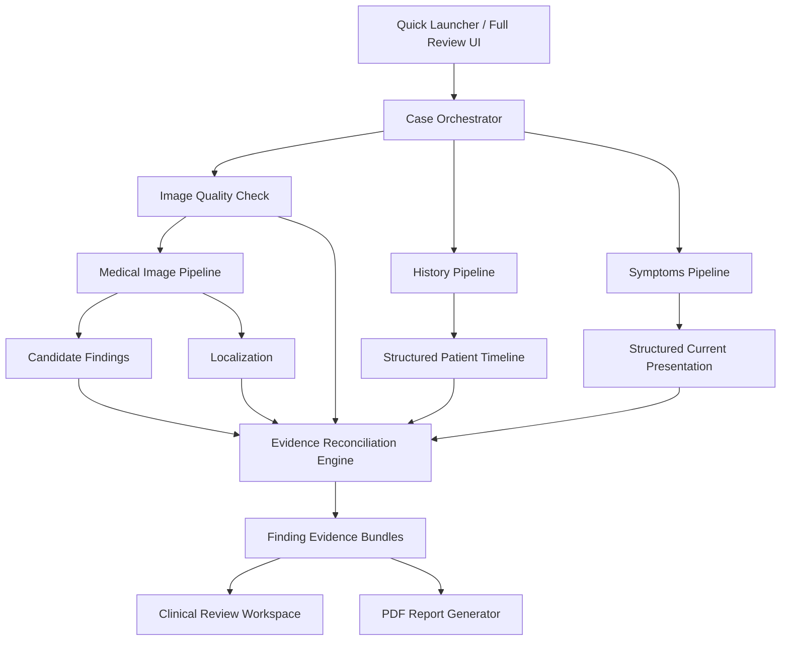

# System Architecture

## 1. Design Principles

1. Evidence before explanation.
2. Structured outputs between components.
3. Model disagreement must remain visible.
4. UI must not depend on unfinished model code during development.
5. Every final finding must be traceable.

## 2. High-Level Architecture



## 3. Component Responsibilities

### Desktop Client
- File selection.
- Symptom entry.
- Processing state.
- Review display.
- Image annotation.
- Report generation.

### Case Orchestrator
- Case state.
- Parallel component execution.
- Failure capture.
- Final case assembly.

### Image Quality Check
- File validity.
- Image readability.
- Blur/resolution checks.
- Quality penalty/warnings.

### Medical Image Pipeline
- Preprocessing.
- Primary image model.
- Optional independent verifier.
- Canonical label normalization.
- Localization.

### History Pipeline
- Text extraction.
- Clinical entity extraction.
- Date normalization.
- Negation handling.
- Provenance.
- Timeline construction.

### Symptoms Pipeline
- Natural-language symptom parsing.
- Present/denied distinction.
- Duration if available.

### Evidence Reconciliation Engine
Core project layer.

It combines:
- image evidence,
- localization,
- history evidence,
- symptom evidence,
- negative evidence,
- model disagreement,
- quality limitations.

### Report Generator
- Evidence-focused PDF.
- Annotated image.
- Case summary.
- Limitations.

## 4. Case State Model

```text
CREATED
  ↓
INPUT_READY
  ↓
PROCESSING
  ↓
RECONCILING
  ↓
REVIEW_READY
```

Failure states:
- INVALID_SCAN
- HISTORY_PARSE_FAILED
- IMAGE_MODEL_FAILED
- INSUFFICIENT_EVIDENCE

## 5. Evidence Object

```json
{
  "id": "ev_001",
  "type": "history_fact",
  "concept": "congestive_heart_failure",
  "polarity": "positive",
  "date": "2025-04-12",
  "source": {
    "file": "history.pdf",
    "page": 3
  },
  "confidence": 0.93
}
```

Image evidence:

```json
{
  "id": "ev_img_009",
  "type": "image_finding",
  "concept": "pleural_effusion",
  "score": 0.87,
  "region": {
    "type": "bbox",
    "x1": 0.61,
    "y1": 0.68,
    "x2": 0.84,
    "y2": 0.91
  },
  "model": "primary_cxr_model"
}
```

## 6. Finding Bundle

```json
{
  "finding": "pleural_effusion",
  "status": "SUPPORTED",
  "evidence_strength": "high",
  "image_support": ["ev_img_009"],
  "history_support": ["ev_001"],
  "symptom_support": ["ev_sym_003"],
  "negative_evidence": [],
  "contradictions": [],
  "quality_warnings": [],
  "localization": {
    "type": "bbox",
    "coordinates": [0.61, 0.68, 0.84, 0.91]
  }
}
```

## 7. Storage

Qualifier MVP:
- Local case directory.
- JSON state.
- Temporary uploaded files.
- Generated report.

```text
cases/
  CASE_001/
    scan/
    history/
    parsed/
    model_outputs/
    report/
    case.json
```

## 8. Failure Handling

### Missing History
Continue image analysis but label clinical context as unavailable.

### Missing Symptoms
Continue with image + history.

### Model Failure
Do not fabricate finding.

### Poor Image Quality
Reduce evidence strength or return INSUFFICIENT_EVIDENCE.

### Model Disagreement
Return UNCERTAIN or CONFLICTING.

## 9. Deployment

Recommended qualifier setup:
- Desktop client.
- Local backend service.
- Local or explicitly declared remote model inference.
- No production patient database.
