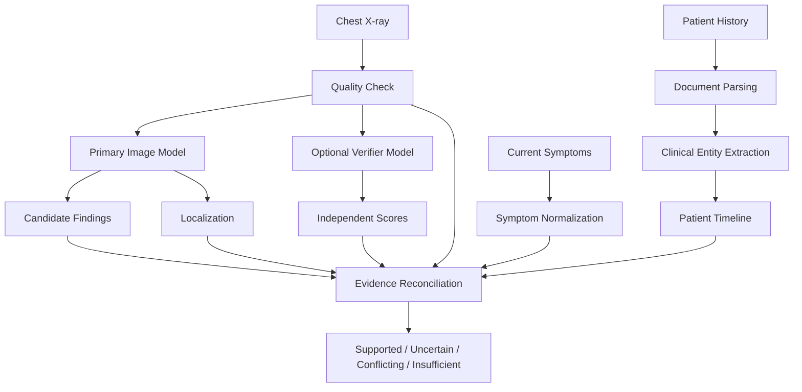

# AI Pipeline

## 1. Goal

The AI pipeline must produce grounded findings rather than unsupported predictions.

The pipeline should answer:

- What candidate finding exists?
- Where is the visual evidence?
- What patient context is relevant?
- What supports the finding?
- What contradicts it?
- How strong is the combined evidence?

## 2. Pipeline



## 3. Model Roles

The HackNex PS does not prescribe specific models.

Model names below are implementation candidates and must be validated by the team before final inclusion.

### Primary Chest X-ray Model
Purpose:
- candidate finding generation,
- preferably grounded localization.

### Independent Verifier
Purpose:
- reduce single-model dependence,
- expose disagreement.

### Clinical Context Model
Purpose:
- classify or summarize structured history relevance,
- explain already-established evidence.

It must not invent image findings.

### Optional Segmentation Model
Purpose:
- refine a localized region into a visual mask.

## 4. Canonical Finding Vocabulary

Normalize model labels to:

- PLEURAL_EFFUSION
- CARDIOMEGALY
- PNEUMOTHORAX
- CONSOLIDATION
- PULMONARY_EDEMA
- ATELECTASIS

## 5. History Parsing

```text
document
  ↓
text extraction
  ↓
page segmentation
  ↓
clinical entity extraction
  ↓
date normalization
  ↓
negation detection
  ↓
provenance attachment
  ↓
timeline
```

Each fact must preserve:
- concept,
- state,
- date,
- source file,
- page,
- extraction confidence.

## 6. Symptom Parsing

Input:
“Shortness of breath with ankle swelling, no fever.”

Output:

```json
[
  {"concept": "dyspnea", "state": "present"},
  {"concept": "peripheral_edema", "state": "present"},
  {"concept": "fever", "state": "denied"}
]
```

## 7. Relevance Layer

For each candidate finding, retrieve only relevant history.

Example:

Finding:
PLEURAL_EFFUSION

Potentially relevant:
- heart failure,
- prior pleural effusion,
- malignancy,
- pneumonia,
- dyspnea,
- peripheral edema.

Irrelevant history should remain outside the reasoning bundle.

## 8. Evidence Reconciliation

For finding `F`:

- `S_image` = image support
- `S_localization` = localization support
- `S_history` = relevant history support
- `S_symptoms` = current symptom support
- `S_verifier` = independent verifier support
- `P_conflict` = contradiction penalty
- `P_quality` = image-quality penalty

The qualifier MVP may use a transparent heuristic instead of pretending to have clinically calibrated probability.

Example:

```text
EvidenceScore =
  0.35 * ImageSupport
+ 0.15 * LocalizationSupport
+ 0.15 * HistorySupport
+ 0.10 * SymptomSupport
+ 0.15 * VerifierSupport
- 0.05 * ConflictPenalty
- 0.05 * QualityPenalty
```

This formula is a project implementation choice, not a clinical standard.

Use it only as an interpretable evidence score.

## 9. State Decision

Illustrative:

- SUPPORTED — strong image evidence and no major contradiction.
- UNCERTAIN — weak/mixed evidence.
- CONFLICTING — strong disagreement between sources/models.
- INSUFFICIENT_EVIDENCE — missing/poor-quality evidence.

## 10. LLM Use Policy

Allowed:
- structure extracted history,
- normalize symptom text,
- summarize already-retrieved evidence,
- generate clinician-facing explanation from structured evidence.

Not allowed:
- create unsupported findings,
- invent confidence,
- override model disagreement,
- claim definitive diagnosis.

## 11. Annotation Rendering

Machine localization:
- box,
- mask,
- heatmap.

Human-facing rendering:
- subtle outline,
- circle,
- arrow,
- label.

The raw localization remains inspectable.

## 12. Poor-Quality Image Handling

If quality is poor:
- surface warning,
- reduce evidence strength,
- avoid forced classification,
- allow INSUFFICIENT_EVIDENCE.

## 13. Output Example

```json
{
  "finding": "pleural_effusion",
  "status": "SUPPORTED",
  "evidence_strength": "high",
  "image_score": 0.87,
  "history_support": [
    "congestive_heart_failure"
  ],
  "symptom_support": [
    "dyspnea",
    "peripheral_edema"
  ],
  "negative_evidence": [],
  "contradictions": [],
  "localization": {
    "type": "bbox",
    "region_name": "right_costophrenic_angle"
  },
  "clinician_text": "Consider a possible right pleural effusion. Imaging and supplied clinical context are concordant. Clinical review is required."
}
```
