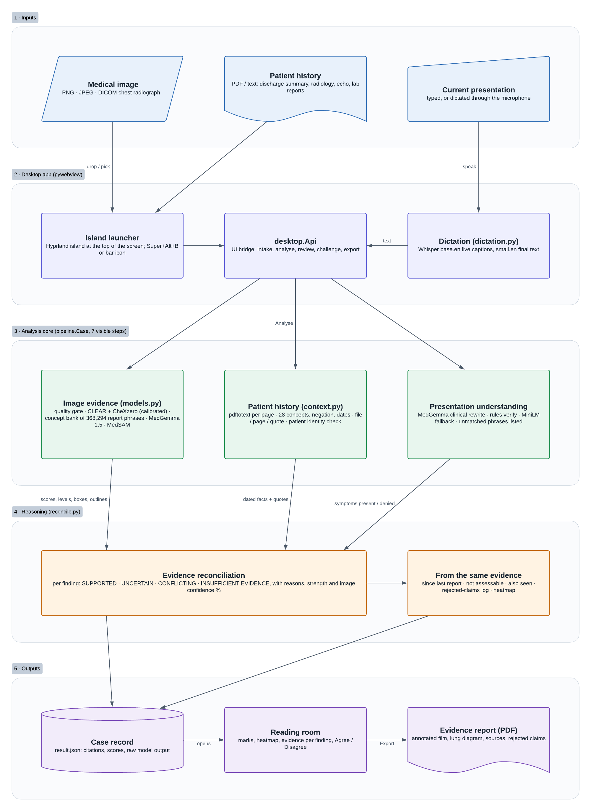
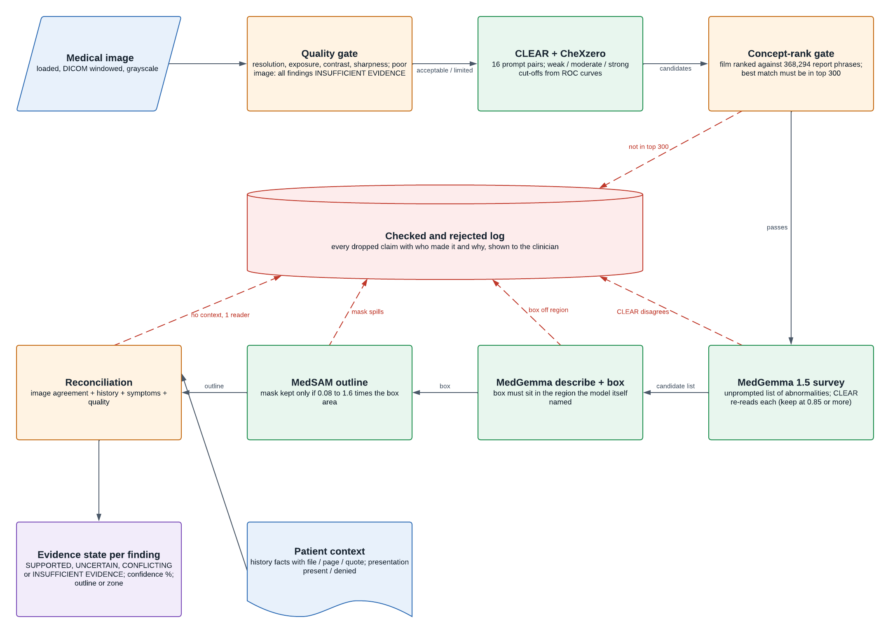
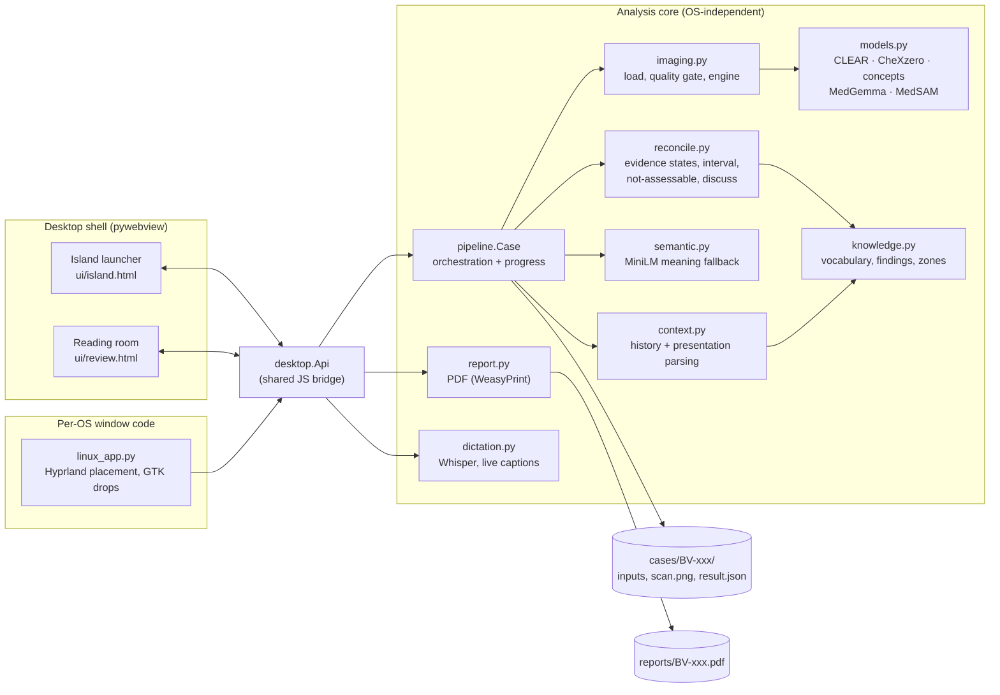
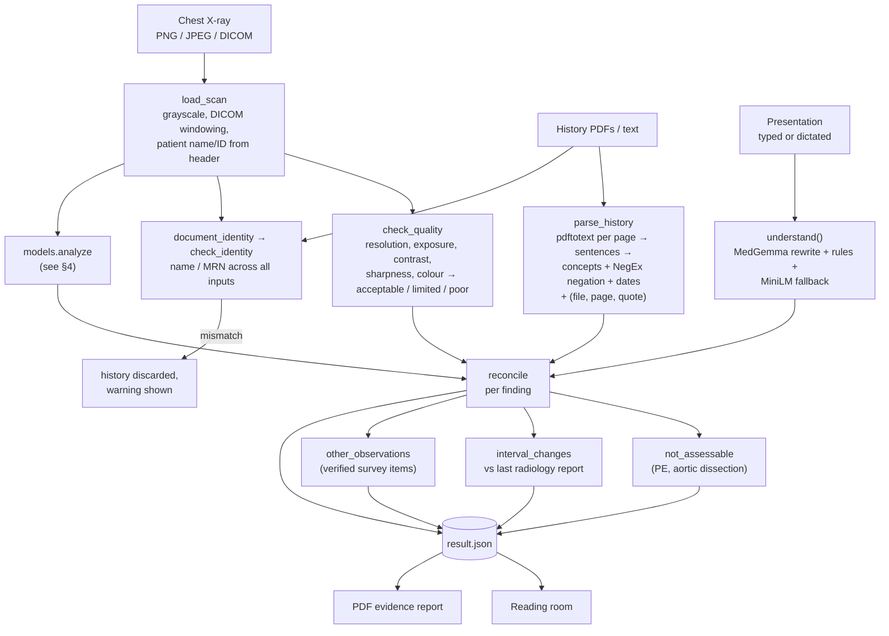
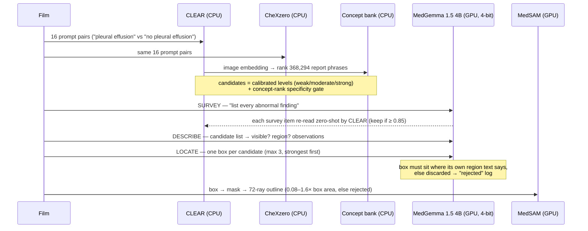
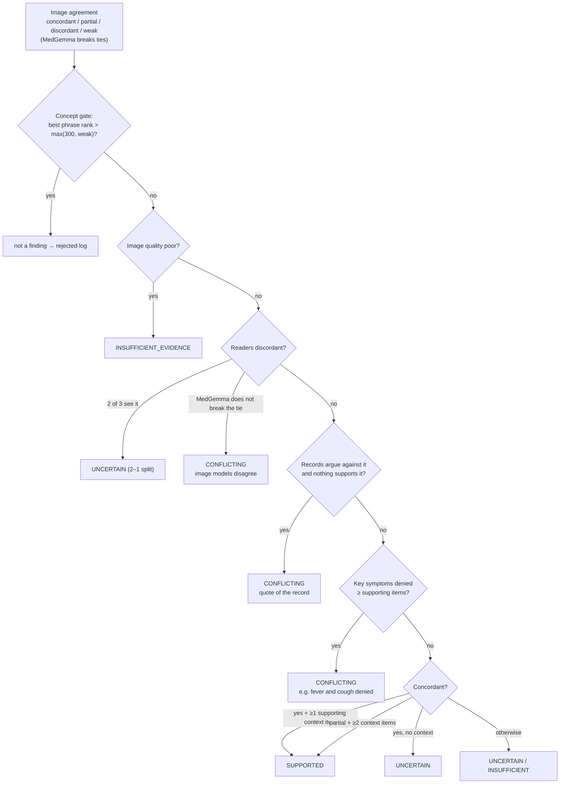
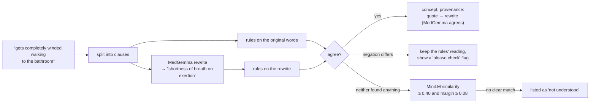
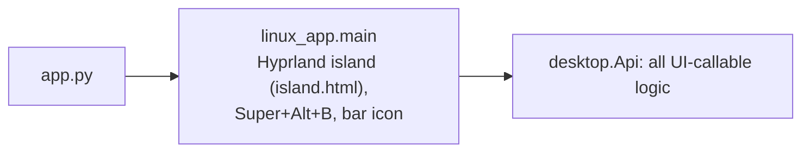

# Bonaventure — System Architecture (as built)

This document describes the system **as implemented** in this repository. The numbered documents `01`–`15` are the
pre-build specifications; where they differ, this file and the code are authoritative.

> Bonaventure is decision support. It never states a diagnosis; every output is a candidate for a clinician to review.

---

## 1. One-paragraph summary

A clinician drops a **chest X-ray** (PNG/JPEG/DICOM), the patient's **history documents** (PDF/text) and types or dictates
the **current presentation**. Four locally-run models read the film — **CLEAR** and **CheXzero** score 16 findings,
CLEAR's **concept bank** ranks the film against 368,294 report phrases, **MedGemma 1.5** describes, surveys and boxes what
it sees, and **MedSAM** turns each box into an outline. In parallel, the history is parsed into dated, negation-aware
concepts with **file + page + quote provenance**, and the presentation is understood by MedGemma (rewrite to clinical
terms) checked by deterministic rules. A rule-based **reconciliation engine** then decides, per finding, whether the evidence
is **SUPPORTED, UNCERTAIN, CONFLICTING or INSUFFICIENT_EVIDENCE**, with the reasons. Everything a model claimed but the
evidence did not back is kept in a **"checked and rejected"** log. The result is shown on a dark reading-room screen with
hand-drawn marks, and exported as a PDF evidence report.

---

## 2. Overview diagrams





## 2b. Component view



| Module | Responsibility | Key functions |
|---|---|---|
| `app.py` | Entry point | `main()` → `linux_app.main` |
| `desktop.py` | Every UI-callable method (shared by both OSes) | `Api.analyze`, `progress`, `get_case`, `challenge`, `record_override`, `export_report`, `start_dictation` … |
| `linux_app.py` | Window placement (Hyprland), global shortcut, GTK drag-and-drop | `LinuxApi._place_island`, `_bind_file_drops` |
| `pipeline.py` | Runs one case through 7 visible steps, catches failures, writes `result.json` | `Case.run`, `understand()` |
| `imaging.py` | Scan loading (incl. DICOM), quality gate, background model loading, GPU lock | `load_scan`, `check_quality`, `ImagingEngine` |
| `models.py` | Model adapters and the image-evidence stage | `analyze`, `ZeroShot`, `ConceptBank`, `MedGemma`, `MedSAM` |
| `context.py` | History and presentation → concepts with negation, dates, durations, provenance; patient identity | `parse_history`, `parse_symptoms`, `check_identity` |
| `semantic.py` | Meaning-based match for phrases no rule recognises | `ConceptMatcher.match` |
| `reconcile.py` | Evidence states and every other judgement shown to the clinician | `reconcile`, `not_assessable`, `interval_changes`, `discuss` |
| `knowledge.py` | Clinical vocabulary; which history/symptom bears on which finding; anatomical zones | `FINDINGS`, `HISTORY_CONCEPTS`, `SYMPTOM_CONCEPTS`, `ZONES` |
| `report.py` | Annotated film, lung diagram, PDF | `generate`, `annotate`, `lung_diagram` |
| `dictation.py` | Offline speech-to-text with live captions | `Dictation.start/partial/stop` |
| `model_paths.py` | Finds model files in either supported layout | constants + `BV_*` env overrides |

---

## 3. Data pipeline (input → output)



Progress steps shown to the clinician (no model names, by design): *Reading chest X-ray → Extracting patient timeline →
Structuring current presentation → Evaluating image findings → Localizing findings → Reconciling evidence → Preparing review.*
Each step reports `pending / running / complete / skipped / failed`; a failure stops the case with a plain-language error
(`INVALID_SCAN`, `IMAGE_MODEL_FAILED`, `INTERNAL`) and the technical traceback behind a "details" link.

---

## 4. Image-evidence stage (`models.analyze`)



| Reader | Role | What it contributes | Where it runs |
|---|---|---|---|
| CLEAR (DINOv2 ViT-B/14 + text) | Primary image reader | Score per finding from a positive/negative prompt pair | CPU, ~1.2 s |
| CheXzero (CLIP ViT-B/32) | Independent verifier | Same prompts, separately trained model | CPU, ~0.1 s |
| CLEAR concept bank | Specificity check + third reader | Rank of the best report phrase naming each finding among 368,294; shown as quotes | CPU, ~0.1 s |
| MedGemma 1.5 4B-it | Visual reasoning | Open survey, per-candidate visibility + observations, bounding boxes, plain-language rewrite of the presentation, second look when challenged | GPU, ~10–16 s |
| MedSAM (ViT-B) | Segmentation | Box → mask → outline the UI traces | GPU fp16 (CPU fallback), ~0.8 s |

**Calibration.** For every finding and reader, three cut-offs are read off the ROC curve on labelled films
(`scripts/calibrate.py` → `bonaventure/calibration.json`): *weak* = 90 % sensitivity, *moderate* = Youden's J,
*strong* = 90 % specificity. A reader only votes on findings where its AUROC ≥ 0.70. Concept-bank rank cut-offs are
measured the same way (`scripts/eval_concepts.py` → `concept_calibration.json`).

**Confidence %.** The same script fits a Platt curve per reader and finding (`platt` in `calibration.json`);
`reconcile._confidence` reports each reader's calibrated probability and their mean as the finding's image confidence.

**Heatmap.** `ZeroShot.occlusion` (CheXzero) greys out each cell of an 8×8 grid on the film and records each shown
finding's score drop. It is computed once per case after reconciliation and stored as `finding.heatmap`.

**Candidate rule.** One reader at *moderate* or every reader at least *weak*; a finding with a single reliable reader
needs that reader at *strong*. A specific finding suppresses its overlapping parent (cardiomegaly → widened mediastinum,
consolidation → pneumonia).

---

## 5. Reconciliation (`reconcile._assess`)



Then: with no history **and** no presentation, a finding is shown only if both image models agree or MedGemma named it
unprompted (survey) and CLEAR confirmed it; otherwise it goes to the rejected log. Devices (exempt from the context rule)
need that same unprompted, CLEAR-confirmed evidence before SUPPORTED. A weak concept-bank rank caps SUPPORTED at UNCERTAIN; findings read only by the concept bank (emphysema, fibrosis)
need MedGemma to see them **and** a supporting history item. **Evidence strength** (high / moderate / low) is a points
score — image agreement + 0.5 per supporting context item − 0.5 per contradicting item − 0.5 for limited quality — and
*high* additionally requires SUPPORTED with at least one context item. It is a rule-based summary, **not** a probability;
the calibrated part is the per-reader weak/moderate/strong level.

**Localization** for each finding is, in order of preference: MedSAM contour → MedGemma box → an approximate anatomical
**zone** from the region text (`knowledge.ZONES`), drawn and labelled as "approx. zone" so it is never mistaken for a
model outline.

**Other outputs from the same evidence:**

| Output | Rule |
|---|---|
| Not assessable on X-ray | Pulmonary embolism / aortic dissection raised when context has ≥2 triggers including one *specific* clue (calf swelling, recent surgery, immobility, prior VTE, suspected PE) — with the test that would settle it |
| Since last report | Today's findings vs the newest dated **radiology report** of the same patient → NEW / KNOWN / NOT SEEN NOW (the last only for reliably-read findings). Blocked on identity mismatch |
| Also seen | MedGemma survey items outside the catalogue, only if CLEAR independently agrees (≥ 0.85) |
| Checked and rejected | Every model claim dropped by a gate, with who claimed it and why |
| Clinician challenge | `discuss()` lays out evidence for and against the clinician's read, MedGemma takes a second look given their reasoning, and the clinician's verdict is recorded next to Bonaventure's in the case and report |

---

## 6. Patient context

**History documents** (`context.parse_history`): `pdftotext` per page → sentences → regex concept matches from
`HISTORY_CONCEPTS` (28 concepts) and `NORMAL_PHRASES` (explicit normals such as "normal heart size" count as evidence
*against*). Negation is NegEx-style (trigger words within 8 words, stopped by conjunctions or a new clause after a comma).
Dates: ISO, DD/MM/YYYY, "Aug 3, 2025", "since 2019"; month-precise header dates carry forward to later sentences. The
document type (discharge summary, radiology report, echo …) is detected per section, so a combined PDF is split
correctly. Every event keeps `{file, page, quote, doc_type, date}`.

**Patient identity** (`check_identity`): names (normalised to surname + initials) and MRNs from every document and the
DICOM header. Two different people → the history is not used, interval comparison is blocked, a banner explains why.

**Current presentation** (`pipeline.understand`), three layers so nothing is silently guessed:



**Dictation** (`dictation.py`): microphone → raw 16 kHz PCM (`pw-record`, PipeWire) →
Whisper base.en re-reads the recording every ~1 s for live captions → on stop, Whisper small.en reads the whole recording
for the final text. Both are primed with a clinical vocabulary prompt. All on CPU.

---

## 7. Desktop shell



* `linux_app.py` only does window placement (Hyprland), the shortcut and GTK drag-and-drop. Analysis, review, dictation
  and reports live in `desktop.Api` and the pipeline, so another OS only needs its own shell module.
* Single instance: a UNIX socket (`$XDG_RUNTIME_DIR/bonaventure.sock`) — a second launch, the keybind or the bar button
  just toggles the running island (two copies would not fit two sets of models on a 6 GB GPU).
* Models load in a background thread while the island is already usable; analysis waits on a `threading.Event`, and one
  lock serialises GPU use.

---

## 8. Runtime and resources (tested machine)

| | |
|---|---|
| Hardware | Laptop, RTX 3050 6 GB, 12 CPU threads |
| GPU | MedGemma 4-bit NF4 + MedSAM fp16, peak ≈ 5.1 GB |
| CPU | CLEAR, CheXzero, concept bank (fp16, ~565 MB RAM), Whisper, MiniLM |
| Time per case | ~6 s (normal film) to ~25 s (three localized findings, incl. ~4 s heatmap); MedGemma dominates |
| Network | None at runtime (`HF_HUB_OFFLINE=1`) — no patient data leaves the machine |

---

## 9. Data contract (`cases/BV-xxx/result.json`)

```text
case_id, state, created
scan{file, view, width, height, patient_name?, patient_id?}     quality{state, warnings, metrics}
identity{status: consistent|mismatch|unknown, sources, message}
presentation_text, symptoms[{concept, label, state, duration, text, source}]
understanding_flags[], unrecognised[]
timeline[{concept, label, category, date, source{file, page, quote, doc_type}}]
findings[{
   canonical_name, display_name, status, evidence_strength, clinician_text,
   localization{type: contour|bbox|zone, coordinates, contour?, zones, region_name, source},
   image_evidence[], history_evidence[], symptom_evidence[], negative_evidence[], contradictions[], notes[],
   signals{image, verifier, agreement, history, symptoms}, technical{scores, thresholds, models}
}]
summary{counts, overall_quality, message}
not_assessable[], other_observations[], interval{status, rows[], compared_to}, rejected[{claim, by, reason}]
overrides{finding_id: {verdict, note, at, discussion}}        (after clinician review)
technical{models, timing, raw_reasoning, top_concepts, total_seconds}
```

A complete real example is in [`docs/sample_output/case_A_result.json`](sample_output/case_A_result.json).
