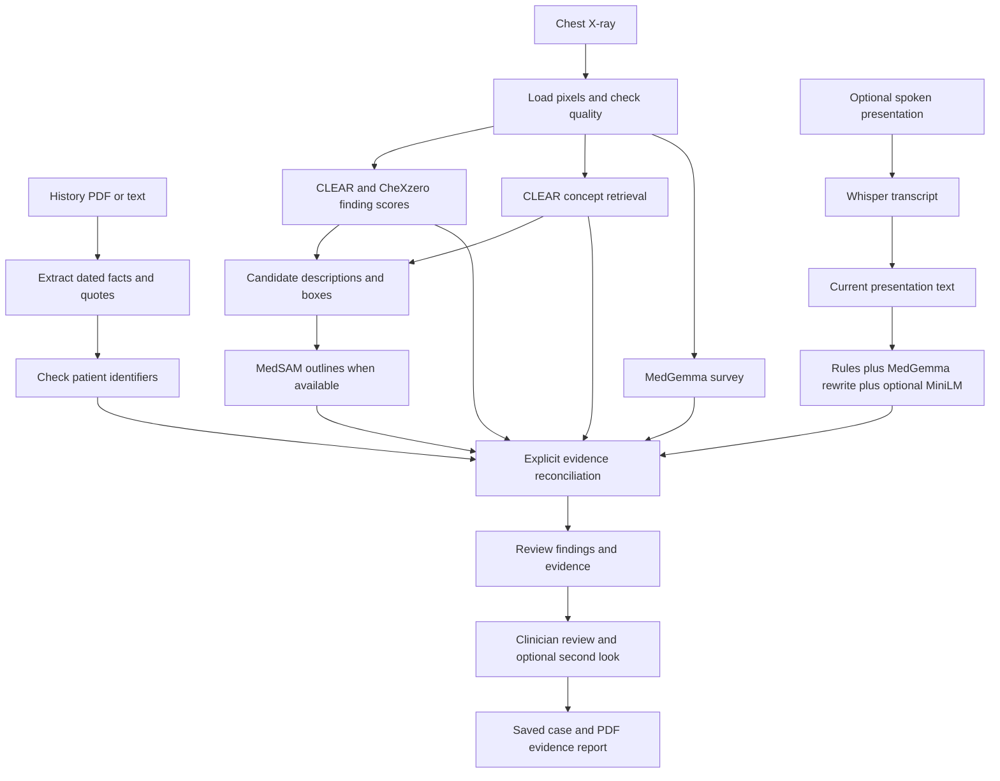

# Bonaventure: understand the project and defend it to judges

This guide describes the working-copy implementation inspected on 7 October 2026, including newly present Platt image-confidence calibration, occlusion heatmaps and stricter image-only filters. The evidence is source code, calibration files, saved demo outputs and the saved audit. The saved demos/audit predate those additions; they illustrate recorded behavior, not newly benchmarked behavior. The model inference pipeline was not rerun to produce this guide. The context, reconciliation and model-parser self-checks passed.

Read sections 1–9 first. Then practise answering the questions in section 13 without looking. The numerical examples are actual saved project outputs, not invented patient results.

## 1. What the project is

Bonaventure is a local desktop prototype for reviewing chest X-ray evidence together with patient history and the current presentation. It helps a clinician inspect candidate findings and disagreements. It does not establish a definitive diagnosis or predict future disease progression.

The central question is: **Does what the image suggests agree with the evidence about this patient?**

For each finding that survives the filters, the system produces a state:

| State | Meaning in this implementation |
|---|---|
| SUPPORTED | Image evidence and enough relevant context satisfy the support rules; hardware devices have a context exception. |
| UNCERTAIN | Some evidence exists, but the support rules are not fully satisfied. |
| CONFLICTING | Sources disagree under the explicit conflict rules. |
| INSUFFICIENT_EVIDENCE | A candidate cannot be assessed reliably, including because the image is poor. |

Each state comes with image observations, related history, symptoms, negative evidence, reasons, a location when available, and an evidence-strength label. A finding can be CONFLICTING with moderate strength: the strength measures the collected evidence, while the state describes its consistency.

**Thirty-second introduction:**

> Bonaventure combines a chest X-ray, patient documents and current symptoms into an evidence review. CLEAR and CheXzero score candidate findings, CLEAR retrieves matching radiology phrases, MedGemma describes and localizes observations, and MedSAM refines locations into outlines. Our explicit reconciliation rules show whether the evidence supports a finding, conflicts, remains uncertain or is insufficient. The clinician sees the sources, rejected claims and limitations, can record their own verdict, and can export an evidence report. Everything runs locally after setup.

## 2. Vocabulary you need before explaining the models

| Term | Plain-language meaning |
|---|---|
| Inference | Running a previously trained model on a new input. |
| Pretrained model | A model whose weights were learned by an external team before this project used it. |
| Zero-shot classification | Asking a pretrained image–text model about a finding using text prompts, without training a new classifier for that finding here. |
| Embedding | A list of numbers representing an image or text so their similarity can be compared. |
| Image encoder | The model component that transforms image pixels into an embedding. |
| Text encoder | The component that transforms words into an embedding. |
| Vision Transformer, or ViT | An image model that processes image patches using attention. ViT-B/14 and ViT-B/32 identify base-sized architectures with 14- and 32-pixel patches. |
| Cosine similarity | A comparison of the direction of two embeddings. More similar directions indicate a stronger learned association. |
| Sigmoid | A mathematical conversion of a number to a value between 0 and 1. That range does not by itself make the value a trustworthy clinical probability. |
| Threshold | A cutoff used to convert a continuous score into an operational category. |
| Bounding box | A rectangle around an estimated region. |
| Segmentation mask | A pixel-level foreground/background prediction within an image. |
| Contour | An outline derived from a mask. |
| Provenance | The source of an extracted fact: document, page, quote and date. |
| Negation | Recognizing that “no fever” denies fever rather than supports it. |
| Calibration here | Choosing per-reader, per-finding decision cutoffs using labelled films. The current code also fits logistic probability calibrators for image-only estimates. Neither validates the final context-based evidence strength. |

## 3. Input to output: the whole path



### 3.1 Intake and case creation

The small island launcher accepts a scan, multiple history files and typed or dictated presentation text. A scan is required; history and presentation are optional. The desktop bridge copies the selected inputs into `cases/BV-xxx/inputs/` and runs analysis in a background thread. The UI polls progress while analysis proceeds.

The core supported scan formats are PNG, JPEG and DICOM. The file picker also accepts BMP, TIFF and WebP. Documents can be text-bearing PDF, TXT or Markdown. Accepting a file format does not establish that the file is a valid frontal chest X-ray.

### 3.2 Load and standardize the scan

Ordinary images have EXIF orientation applied and are converted to grayscale. Their original colour content is recorded for quality checking.

DICOM uses `pydicom` to load pixel values. MONOCHROME1 images are inverted. The 0.5th and 99.5th pixel percentiles define a clipped intensity range that is mapped into an 8-bit grayscale image. Patient name, patient ID and view information are extracted when available.

This is a simple DICOM pathway, not a comprehensive medical-image viewer: the code does not implement every modality LUT, rescale, windowing or multi-frame workflow.

### 3.3 Quality checking

Quality checking is deterministic; there is no separate learned quality model. The image is resized to 512×512 for brightness, contrast and sharpness measurements.

| Measurement | Rule |
|---|---|
| Original smaller image dimension | Below 320 pixels is severe; below 768 is a warning. |
| Mean grayscale brightness | Below 45 or above 205 generates an exposure warning. |
| Pixel standard deviation | Below 28 generates a low-contrast warning. |
| Variance of a discrete Laplacian | Below 12 generates a blur/compression warning. |
| Colour metric | Above 25 is severe and suggests a non-radiograph. |

Any severe issue, or two or more warnings, produces `poor`. One warning produces `limited`. No warnings produces `acceptable`.

Poor quality does not skip all image inference. It forces surviving reconciled candidates to INSUFFICIENT_EVIDENCE. Limited quality subtracts 0.5 from the evidence-strength calculation. These checks do not reliably assess rotation, inspiration, positioning, anatomical coverage or view correctness.

### 3.4 Extract history with provenance

PDF text comes from Poppler's `pdftotext`; the model does not read PDF page images. The parser splits text into sentences, matches a controlled clinical vocabulary, recognizes simple negation, assigns dates, and records each fact's file, page, document type and source quote.

For example, “Congestive heart failure since 2019” can become a present CHF event with date 2019 and the original sentence as its source. “No pleural effusion” becomes a negated prior-effusion event. “Normal heart size” is explicitly mapped to evidence against prior cardiomegaly.

Dates come from recognizable formats. The parser takes the nearest date in a sentence or carries forward a prior month/day-level document date. It does not independently establish whether a condition has resolved. Quotes are retained, with long sentences cropped to a roughly 200-character excerpt.

The vocabulary covers diagnoses, previous imaging findings, medication classes, procedures and risk factors. It is not a general EHR parser or a general numerical laboratory interpreter. For example, some low-LVEF expressions are mapped to CHF, but there is no broad engine interpreting arbitrary measurement values.

Scanned PDFs without a text layer produce a warning: **OCR is not implemented.**

### 3.5 Check patient identity

Patient names and MRNs/IDs are compared across documents and a DICOM header when identifiers are present. Simple name normalization tolerates initials/order variations. Different normalized names or IDs produce `mismatch`, remove document-history events from reconciliation, and block prior-report comparison.

No identifiers means `unknown`, not “identity verified.” PNG/JPEG input does not provide DICOM identifiers. A consistent set of extracted identifiers is also not a guarantee that every source belongs to the correct real person.

Current presentation text remains usable after document mismatch. Therefore an identity warning does not force every image finding to disappear or become insufficient.

### 3.6 Understand the current presentation

Whisper first converts optional speech to text. The presentation is then split into clauses and processed through:

1. Rules on the original phrase: clinical synonyms, negation and durations.
2. MedGemma rewrites into clinical wording, if the reasoning model is ready.
3. The same rules read the rewrite.
4. Original-rule interpretations take precedence if the rewrite disagrees; a visible warning records the disagreement.
5. Optional MiniLM matches otherwise unrecognized phrases by meaning.
6. Whole-text rules recover some concepts and durations that clause splitting missed.

Example: “Can't lie flat” maps to orthopnea; “no fever” maps to denied fever; “for three days” becomes a duration. Model-derived concepts retain their original source clause. Unsupported or unrecognized clauses are listed rather than silently treated as understood.

This layer is not perfect semantic grounding: keeping the original phrase does not prove a model rewrite preserved its meaning. Rules and models can miss or misunderstand wording. First mentions generally win, and conflicting later mentions are not fully resolved.

## 4. What each model does

### CLEAR: primary image–text reader

CLEAR uses a DINOv2 ViT-B/14 image backbone and a paired text encoder. This implementation resizes its input to 448×448 and normalizes pixel values with chest-X-ray statistics. Image and text features share a 768-dimensional space.

For each of the 16 catalogue findings, the program encodes a positive and a negative phrase, such as “pleural effusion” and “no pleural effusion.” It asks which phrase is more similar to the film's embedding. The positive/negative text embeddings are prepared once when the model loads; the image embedding is calculated per case.

Its output is a score for each finding. It does not produce a final clinical decision by itself.

### CheXzero: separately trained image reader

CheXzero uses a CLIP ViT-B/32 checkpoint trained externally using chest X-rays and reports. Bonaventure scores the same finding prompt pairs with its separate weights.

Input preprocessing preserves aspect ratio, resizes and pads the image to a 320×320 canvas, repeats grayscale across three channels, normalizes using CXR statistics and resizes again if the loaded checkpoint requires a different input resolution.

Its purpose is to expose agreement and disagreement with CLEAR. Separate training does not make their errors statistically independent: architectures, medical report wording and pretraining data can still create correlated mistakes.

### CLEAR concept bank: retrieval using CLEAR, not an independent fifth imaging model

The bank contains 368,294 report-derived radiological phrases and their embeddings. The film embedding is compared with every phrase, ranking the bank by cosine similarity. Runtime examines the top 2,500 phrases, keeps up to three supporting and three negated matching phrases per catalogue finding, and returns the overall top ten for technical inspection.

Examples are “chronic recurrent pulmonary edema” or “no pleural effusion.” Pattern matching maps phrases to findings, and a negation check distinguishes supporting from opposing phrases.

This is **retrieval of phrases**, not retrieval of this patient's records or similar patient images. A quoted phrase is a model-associated reference phrase, not a statement written about the current patient. It is also not a pixel-level saliency map or proof of causal reasoning.

Bonaventure uses the backbone prompt scores and direct concept retrieval. It does **not** implement the full CLEAR paper's SFR-Mistral semantic-projection pipeline or train a concept-bottleneck classifier.

### MedGemma 1.5 4B-it: reasoning, description and location

MedGemma is a medical multimodal generative model with an image encoder and language-model component. Bonaventure uses it for five jobs:

| Job | Input → output |
|---|---|
| Open-ended survey | Film → abnormal observations, including items outside the catalogue. |
| Candidate description | Film and candidate names → visibility, anatomical region and up to two observations per finding. |
| Localization | Film and finding name → estimated bounding box. |
| Presentation rewrite | Text clauses → clinical wording for the deterministic parser. |
| Clinician second look | Film, challenged finding, clinician verdict and reasoning → another visible/not-visible opinion and explanation. |

Its survey claims are checked against CLEAR using the same claim phrase and “no [claim].” In the normal full-model path a score of at least 0.85 is required for `verified`. This cutoff is a manually chosen safeguard, not a clinically validated guarantee.

MedGemma can influence image agreement and evidence state. It should not be described as only a box-drawing tool. Equally, its text alone is not accepted as a fully reconciled diagnosis. Observations outside the final catalogue findings can appear under “Also seen.”

The CUDA path uses 4-bit NF4 quantization with bfloat16 computation to reduce memory. The CPU path loads it without this quantization. Generation uses `do_sample=False`; that reduces sampling variability but does not prove correctness or identical output across all hardware/software versions.

### MedSAM: segmentation refinement

MedSAM receives the film and boxes from MedGemma. It does not determine which disease exists. The image is resized to 1024×1024 and intensity-normalized; its image encoder produces features, and a box-prompt encoder plus mask decoder produces a segmentation.

The mask is resized to 256×256 and thresholded at sigmoid output greater than 0.5. Masks are accepted only if foreground area is greater than 0.08 and less than 1.6 times the box area. Empty/tiny or excessively large masks are rejected, keeping the box.

Accepted masks become a 72-point radial contour around the foreground centroid for display. This approximated outline is not a validated disease boundary or quantitative lesion measurement. The implementation does not calculate lesion volume, cancer stage or disease severity from masks. The saved result stores contours; the current real-model return uses an empty `masks` dictionary rather than saved mask PNGs.

### Whisper base.en and small.en: speech recognition

`base.en` produces live captions while recording, approximately every 0.9 seconds plus inference time. `small.en` rereads the recording for the final transcript; a loaded alternative can provide fallback. Audio is 16 kHz mono. Clinical vocabulary prompts bias decoding toward medical wording.

Speech runs on CPU. These models do not assess the X-ray, diagnose the patient or decide evidence strength. Transcription errors can still affect later context extraction. The latest recording is retained locally as `~/bonaventure/last_dictation.wav` for debugging.

### all-MiniLM-L6-v2: optional meaning matching

MiniLM embeds otherwise unrecognized presentation phrases and controlled concept descriptions. A match is accepted only if its cosine similarity is at least 0.40 and exceeds the runner-up by at least 0.08. Otherwise it returns no match.

These are text-matching thresholds. A similarity of 0.60 does not mean a 60% chance of any disease. MiniLM does not read the scan or the PDFs in this pipeline.

Model sources: [CLEAR](https://github.com/peterhan91/CLEAR), [CheXzero](https://github.com/rajpurkarlab/CheXzero), [MedGemma](https://huggingface.co/google/medgemma-1.5-4b-it), [MedSAM](https://github.com/bowang-lab/MedSAM), [Whisper](https://github.com/openai/whisper), [MiniLM](https://huggingface.co/sentence-transformers/all-MiniLM-L6-v2). These sources establish the external components; Bonaventure's own results must be assessed from its own evaluations.

## 5. Precisely how image scoring works

There are several different numbers. Never mix them together.

### 5.1 Raw prompt-pair score

Let `u` be the normalized film embedding, `t+` the normalized positive-prompt embedding and `t−` the normalized negative-prompt embedding. Let `alpha` be the model's exponentiated logit scale, or 100 if it exposes no logit scale.

```text
positive similarity = u · t+
negative similarity = u · t−
score = sigmoid(alpha × (positive similarity − negative similarity))
```

Equivalently, this is the positive entry of a two-item softmax over scaled similarities. Scores are calculated independently for each finding. They do not sum to one across diseases, and multiple findings can have high scores.

A high value means the model embedding favours the positive wording over the negative wording. It does not establish disease probability, disease severity, the precise disease mechanism or an exact affected location. Different wording can change the score. On abnormal films some prompt scores saturate, motivating the concept filter.

### 5.2 Per-reader, per-finding signal levels

The three ordered thresholds turn each score into absent, weak, moderate or strong:

```text
below weak threshold                 → absent
weak ≤ score < moderate threshold    → weak
moderate ≤ score < strong threshold  → moderate
score ≥ strong threshold             → strong
```

The implementation counts passed thresholds, so duplicate thresholds can skip a level. “Absent” here means below a threshold, not a medical rule-out.

There is no universal threshold of 0.5. For cardiomegaly:

| Reader | Weak | Moderate | Strong |
|---|---:|---:|---:|
| CLEAR | 0.5076 | 0.5472 | 0.7291 |
| CheXzero | 0.1943 | 0.1943 | 0.7168 |

Case A's scores 0.9575 and 0.9791 exceed the respective strong cutoffs. CLEAR's edema strong cutoff is 0.9828, illustrating why different findings need different cutoffs.

### 5.3 Where the thresholds came from

`scripts/calibrate.py` measures reader scores on labelled films, builds ROC curves and selects thresholds targeting:

| Target | Definition |
|---|---|
| Weak | A point reaching at least 90% sensitivity: catching labelled positives. |
| Moderate | Maximum Youden's J, `sensitivity + specificity − 1`. |
| Strong | A point with false-positive rate at most 10%, i.e. specificity at least 90%. |

The script sorts those three numeric points before saving weak/moderate/strong cutoffs. If their original numerical order differs, the stored middle threshold is not necessarily the original Youden optimum. Values are rounded. These targets describe the calibration sample and do not guarantee performance on new cases.

The main calibration uses 202 frontal CheXpert validation films. Additional labels use a sampled NIH ChestX-ray14 test subset: 676 films in the checked-in results. NIH sampling unions up to 60 selected positives per label plus 300 normal films; because films can have multiple labels, some final label counts exceed 60.

Readers vote only where recorded AUROC is at least 0.70. Findings without labelled calibration are excluded by this gate. With fewer than 15 positives, raw score thresholds fall back to manually set values: CLEAR `[0.8, 0.9, 0.95]`, CheXzero `[0.5, 0.7, 0.85]`. Pneumothorax has only seven CheXpert positives and uses that fallback. The concept calibration does not have the same 15-positive safeguard.

If the entire calibration file is missing, runtime falls back to manual cutoffs and treats raw readers as reliable. Thus “every vote is always calibrated” is not a guaranteed property of every deployment.

### 5.4 AUROC is not accuracy

Sensitivity is `TP / (TP + FN)`. Specificity is `TN / (TN + FP)`. The ROC curve shows sensitivity against false-positive rate as a threshold varies.

AUROC measures ranking separation across thresholds. An AUROC of 0.90 means roughly that a randomly chosen labelled-positive film ranks above a randomly chosen labelled-negative film 90% of the time, with ties handled appropriately. It does not mean 90% of complete patient reports are correct.

The saved “combined AUROC” uses the average of CLEAR and CheXzero scores for that metric calculation. **Runtime reconciliation does not simply average their scores to make the final decision.**

The newer image-confidence display does average the voting readers' Platt-scaled percentages. That is a separate output from the evidence-state decision.

### 5.5 Concept ranks and specificity filtering

For concept retrieval, a lower best supporting rank is better. The concept calibration evaluates `−log10(rank)` on the labelled films and saves rank cutoffs targeting sensitivity, Youden's J and specificity.

Examples of reliable rank readers:

| Finding | Concept AUROC | Strong rank cutoff | Moderate rank cutoff | Weak rank cutoff |
|---|---:|---:|---:|---:|
| Pulmonary edema | 0.829 | 1 | 4 | 4 |
| Atelectasis | 0.842 | 7 | 78 | 78 |
| Emphysema | 0.829 | 15 | 486 | 486 |
| Fibrosis | 0.768 | 28 | 239 | 2649 |

Where the concept reader is reliable, a raw-score candidate normally requires a supporting rank no worse than `max(300, weak rank cutoff)`. The reconciliation gate has an exception for a matching CLEAR-verified survey observation. A rank worse than the moderate cutoff can cap SUPPORTED to UNCERTAIN. A rank at or better than the strong cutoff can strengthen image agreement unless MedGemma explicitly failed to see it.

Concept calibration searches the top 5,000 phrases, whereas runtime retrieves the top 2,500. This discrepancy particularly affects larger cutoffs. Concept retrieval uses CLEAR's own film embedding, so its evidence is correlated with CLEAR prompt scores.

### 5.6 New image-confidence percentages: Platt scaling

The current calibration file also stores two fitted coefficients, `a` and `b`, per reader and finding. `scripts/calibrate.py` fits scikit-learn logistic regression to the raw score's logit and the known positive/negative labels:

```text
logit(score) = ln(score / (1 − score))
reader image estimate = sigmoid(a × logit(score) + b)
displayed reader percentage = round(100 × reader image estimate)
overall image confidence = rounded average of available voting-reader percentages
```

Scores are clipped away from exactly zero or one before taking the logit. Coefficients and dataset prevalence are saved. Findings without available Platt coefficients have no confidence estimate; concept-only readers currently have none.

This percentage estimates label presence from the image score under the calibration sample's distribution. It does not include history, symptoms, image-quality penalties, segmentation or the final evidence state. The logistic fits do not alter the raw reader thresholds or state rules. A high percentage and CONFLICTING state can therefore coexist.

The average of individually calibrated reader estimates is not demonstrated to be a calibrated ensemble probability. The code does not supply held-out calibration curves, Brier scores or a validated correction for clinical prevalence. A calibration fit is not proof that the percentage generalizes to a hospital population. For background, see [scikit-learn probability calibration](https://scikit-learn.org/stable/modules/calibration.html).

The pretrained foundation models are not retrained, but these small logistic calibrators **are fitted on labelled data**. Say that explicitly if a judge asks what was trained.

Applying the current coefficients to the older Case A raw scores gives the following arithmetic examples; these are not newly run case outputs:

| Finding | CLEAR percentage | CheXzero percentage | Rounded average |
|---|---:|---:|---:|
| Cardiomegaly | 94% | 87% | 90% |
| Pulmonary edema | 79% | 97% | 88% |
| Consolidation | 28% | 34% | 31% |

The final row illustrates how a high raw score can become a much lower fitted estimate. The operational moderate/strong categories still use the original raw-score thresholds.

### 5.7 New occlusion heatmaps: what the reader's score depends on

After reconciliation, the program may compute a heatmap for up to six non-insufficient findings. It selects CheXzero when present, otherwise the primary reader. It divides the original film into an 8×8 grid and replaces each cell in turn with mean-gray pixels. One baseline image and 64 altered images are encoded, in batches of 16.

For each finding, the code measures the drop in the scaled positive-minus-negative similarity, i.e. the raw pair **logit**, not the Platt percentage. Positive drops are normalized by their largest value to create a 0–1 grid. Maps are omitted when the maximum drop is too small relative to the baseline logit. The UI overlays the selected finding's map when Heatmap/H is enabled.

Bright cells mean that hiding that region reduced this reader's signal more strongly. This is a coarse model-sensitivity visualization, not a segmentation, proof of pathology or proof that the model attended to a clinically correct feature. Occlusion creates artificial inputs and can reveal spurious dependencies. It adds inference work and does not change the final status or strength. Saved older cases without a heatmap do not gain one just by being opened.

## 6. Which findings can actually enter the decision engine?

The vocabulary has 16 findings. Having a catalogue entry is not a claim of reliable detection.

| Finding | Simple meaning | Image route permitted by current calibration |
|---|---|---|
| Pleural effusion | Fluid around a lung | CLEAR and CheXzero |
| Cardiomegaly | Enlarged heart silhouette | CLEAR and CheXzero |
| Pneumothorax | Air in the pleural space | Both; very small calibration sample, manual cutoffs |
| Consolidation | Dense airspace opacity | CLEAR and CheXzero |
| Pulmonary edema | Fluid-related lung opacity | CLEAR and CheXzero |
| Atelectasis | Reduced aeration/collapse | CLEAR and CheXzero |
| Pneumonia | Infection-related finding label | CLEAR only; suppressed when consolidation is raised |
| Lung nodule | Small focal lesion label | No reliable catalogue reader; may appear as survey observation |
| Lung mass | Larger focal lesion label | No reliable catalogue reader; may appear as survey observation |
| Emphysema | Emphysema-related film pattern | Reliable concept bank, with MedGemma visibility and supporting history required |
| Pulmonary fibrosis | Fibrotic lung pattern | Reliable concept bank, with MedGemma visibility and supporting history required |
| Pleural thickening | Thickened pleural tissues | CheXzero only |
| Widened mediastinum | Enlarged central chest silhouette label | Both; suppressed when cardiomegaly is raised |
| Rib fracture | Broken rib label | No labelled calibration and no reliable catalogue voter |
| Hiatus hernia | Hiatal hernia label | CheXzero; reliable concept bank also filters its evidence |
| Lines & devices | Tubes, lines and implanted hardware | Both; the context exception additionally requires MedGemma or verified-survey visibility in the newer rules |

The model label “enlarged cardiomediastinum” is exposed as “widened mediastinum.” These are not identical clinical concepts. Similarly, consolidation is an imaging pattern and does not establish pneumonia as its cause.

A candidate with two reliable readers is raised if at least one is moderate or both are at least weak. With only one reliable reader, that reader must be strong. Localizations can preserve a candidate in reconciliation, and reliable concept retrieval provides another route. Concept-only findings additionally require MedGemma confirmation and relevant positive history.

## 7. From candidate to evidence state and strength

### 7.1 Gather relevant context

`knowledge.py` explicitly maps each finding to related history concepts, related symptoms and selected symptoms whose denial counts against it. These relationships are authored rules, not learned during this project.

For example, cardiomegaly uses previous cardiomegaly, CHF, cardiomyopathy, hypertension and valvular disease; related symptoms include breathlessness, orthopnea, ankle swelling and fatigue. Consolidation uses pneumonia/immunosuppression/COPD history and symptoms such as fever, cough and breathlessness.

```text
support = number of distinct supporting history concepts
          + number of supporting symptom entries

against = number of distinct negated relevant history concepts
          + number of denied relevant symptom entries
```

Repeated documents containing the same history concept do not repeatedly increase that concept's support count. Dates and quotes are preserved, but the score has no formal time-decay weighting, validated causal weighting or probabilistic independence correction.

### 7.2 Image agreement

| Reader levels | Initial agreement |
|---|---|
| Both moderate or strong | Concordant |
| One moderate/strong, the other absent | Discordant |
| One moderate/strong and the other weak | Partial |
| No verifier, and the available reader moderate/strong | Partial |
| Other weak combinations | Weak |

MedGemma seeing a partially agreed finding can upgrade agreement to concordant. Strong concept retrieval can also strengthen agreement under the rules. When the raw readers are discordant and MedGemma sees the finding, the result stays UNCERTAIN rather than being settled by majority vote.

### 7.3 State rules, in priority order

Before state assignment, irrelevant/unreliable candidates and some concept-unsupported claims are filtered out. For surviving candidates:

1. Poor quality → INSUFFICIENT_EVIDENCE.
2. Discordant image readers with MedGemma seeing it → UNCERTAIN.
3. Other discordant image-reader cases → CONFLICTING.
4. Concordant/partial image evidence, relevant negative history, and no relevant positive history → CONFLICTING.
5. Concordant/partial evidence plus designated denied symptoms whose count is at least the support count → CONFLICTING.
6. Concordant evidence → SUPPORTED if support is at least one, or it is context-free hardware that MedGemma/the verified survey sees; otherwise UNCERTAIN.
7. Partial evidence → SUPPORTED if support is at least two; otherwise UNCERTAIN.
8. Weak evidence → UNCERTAIN if there is supporting context, otherwise INSUFFICIENT_EVIDENCE.
9. Weak concept rank can downgrade a supported result to uncertain.
10. In the newer rules, a zero-support UNCERTAIN result is rejected entirely if no history/presentation symptoms were supplied and MedGemma did not confirm it. Other states are not all removed by this filter.

This is a simplified rule system. Absence of fever does not medically exclude consolidation or pneumonia. An old normal report does not prove a new abnormality is false. Bonaventure flags those situations as evidence tension; the clinician must resolve them. The current code does not fully reconcile contradictory historical facts through time.

### 7.4 Evidence-strength calculation

```text
E = image points
    + 0.5 × min(support, 3)
    − 0.5 × against
    − quality penalty
```

| Image agreement | Image points |
|---|---:|
| Concordant with both raw reader levels strong | 3.0 |
| Other concordant | 2.5 |
| Partial | 1.5 |
| Discordant | 1.0 |
| Weak | 0.5 |

Quality penalty is 0.5 for limited quality. Poor quality is handled through the insufficient-evidence state.

Strength is HIGH only if `E ≥ 3`, status is SUPPORTED, and at least one supporting context item exists. Otherwise it is MODERATE if `E ≥ 2` and the status is not INSUFFICIENT_EVIDENCE. Otherwise LOW.

The constants are design choices. This equation is not learned, a Bayesian calculation, a validated clinical score or a confidence percentage. Segmentation precision does not contribute points. Semantic-match similarity does not contribute points directly either; it can affect which context concepts are counted.

The saved `contribution` object contains raw image scores and a `support / (support + against)` context ratio. Those are technical summaries, not SHAP values, learned fusion weights or causal feature attribution. The overall summary's high/moderate/low quality is another rule summary and must not be called patient-level confidence.

## 8. Work through a real result

Case A uses `sample_data/scans/kerley_b.jpg`, a fictional heart-failure history PDF and this presentation:

> Worsening shortness of breath for 3 days, can't lie flat, waking up breathless at night, ankle swelling. No fever, no cough.

The saved image-quality result is acceptable: smaller dimension 1097, mean brightness 164.83, contrast 36.66 and sharpness 57.51.

### Cardiomegaly

| Evidence | Actual saved value |
|---|---|
| CLEAR score | 0.9575 → strong |
| CheXzero score | 0.9791 → strong |
| Supporting context count | 8 |
| Opposing context count | 0 |
| Localization | MedGemma box refined by MedSAM |
| Result | SUPPORTED, HIGH |

```text
E = 3.0 + 0.5 × min(8, 3) − 0.5 × 0 − 0
  = 4.5
```

It is supported because image agreement and patient context satisfy the rules. Its score is not 4.5/5 probability or 95.75% diagnostic certainty. Eight supporting items are capped at three for strength points.

### Pulmonary edema

CLEAR scores 0.9964 and CheXzero 0.9871, both strong. The closest supporting phrase is “chronic recurrent pulmonary edema” at rank 3. Nine supporting context items and no opposing items give `E = 4.5`. Result: SUPPORTED, HIGH.

### Consolidation

CLEAR scores 0.9352, between its moderate and strong cutoffs. CheXzero scores 0.9275, above its strong cutoff. The initial image agreement is concordant. Breathlessness contributes one supportive symptom; fever and cough are denied, contributing two opposing symptoms.

```text
E = 2.5 + 0.5 × 1 − 0.5 × 2 = 2.0
```

The designated denial rule makes the state CONFLICTING. Strength is MODERATE. No reliable model box remains, so an approximate anatomical zone is shown.

This is the best explanation of why high image scores do not automatically become supported clinical findings.

### Other output for Case A

The prior report is dated 12 August 2026. Cardiomegaly and edema are KNOWN relative to its text. Previously described pleural effusion is NOT SEEN NOW by the current candidate pipeline. That wording does not prove complete resolution.

“Interstitial thickening” appears under Also seen after a CLEAR agreement score of 0.965. Nine claims are rejected, including a survey claim of sternal wires and an effusion prompt claim whose best supporting phrase ranks 354.

Saved elapsed time is 20.84 seconds. This is one recorded case on the documented hardware, not a guaranteed latency or a fresh benchmark. The saved case predates the additional occlusion inference and does not contain the newer confidence/heatmap fields.

## 9. Localization, review and final output

MedGemma is asked to localize at most three strong candidates to control runtime. Coordinates arrive as `[y_min, x_min, y_max, x_max]` on a 0–1000 scale and are converted to normalized `[x_min, y_min, x_max, y_max]`.

A box is rejected if it conflicts with the described side/vertical region. Patient right is the viewer's left on a standard frontal image. This check assumes standard orientation and is not a general orientation-validation model. Valid boxes can become MedSAM contours. If no trustworthy box exists, fixed anatomical zones provide an explicitly approximate location. Boxes are guidance, not exact pathology ground truth.

The reading-room interface displays the scan, locations, findings, symptoms, relevant timeline, evidence sources, conflicts, rejected claims and technical details. It lets the clinician open source documents and record agreement or disagreement.

For a disagreement, the system assembles existing evidence for and against the clinician's read and optionally asks MedGemma for a second look. The clinician's final verdict and reasoning are stored alongside the original algorithm output. **This is feedback storage, not online learning.** It does not update weights or calibrated thresholds. The second look is another opinion from the same model, not independent validation.

Cases save original inputs, a display image `scan.png`, and `result.json`. The preview is limited to 1600×1600, whereas inference uses the loaded scan with model-specific resizing. PDF export uses an HTML report rendered by WeasyPrint. It includes an annotated scan, schematic lung diagram, per-finding evidence, relevant context, interval comparison, advisories, clinician review, rejected claims and limitations. The report is primarily generated from structured data and templates, not freely composed by an LLM.

### Prior-report comparison

The program uses dated radiology-report facts, selecting the latest fact per concept. It does not ingest a second historical X-ray for pixel comparison.

| Label | Actual rule meaning |
|---|---|
| NEW | Prior text said absent; a finding is now raised. |
| KNOWN | Prior text said present; a finding is now raised. |
| NOT SEEN NOW | Prior text said present; no finding is currently raised, for a label with a reliable raw image reader. |

Current raised findings include supported, uncertain and conflicting states. Therefore NEW and KNOWN are not independent confirmations of disease. Different concepts can use dates from different reports; the overall displayed comparison date does not mean every row came from one single report.

### Conditions the scan cannot settle

Rules can raise a separate advisory for pulmonary embolism or aortic dissection when specific context triggers are met. These are not image diagnoses. The follow-up wording is authored in `knowledge.py`; the system does not calculate Wells, PERC or a personalized treatment plan. For judge discussion, explain the advisory mechanism rather than presenting its text as validated clinical guidance.

## 10. Evaluation: what you can honestly claim

Representative recorded raw-reader AUROCs:

| Finding | CLEAR | CheXzero | Average-score AUROC |
|---|---:|---:|---:|
| Pleural effusion | 0.909 | 0.884 | 0.904 |
| Cardiomegaly | 0.848 | 0.825 | 0.843 |
| Pulmonary edema | 0.912 | 0.906 | 0.935 |
| Consolidation | 0.901 | 0.851 | 0.897 |
| Atelectasis | 0.814 | 0.786 | 0.817 |

These numbers are computed on datasets used for threshold selection. They are not a separate prospective validation of the finished application or proof that the newer Platt percentages are well calibrated. A two-reader average is not always better than the better reader.

The saved full-pipeline audit runs 36 other NIH films without history or presentation. It predates the newer device-confirmation and bare-image rejection rules and the confidence/heatmap outputs, so its rates must not be presented as a fresh benchmark of those changes. The script excludes calibration **images**. It does not establish a patient-disjoint cohort or prove absence from every external model's pretraining data.

| Audit measure | Recorded result |
|---|---:|
| Films labelled normal | 12 |
| Normal-labelled films with any supported finding | 1 |
| Normal-labelled films with any raised finding | 9 |
| Normal-labelled films with Also seen observations | 3 |
| Disease-labelled films | 24 |
| Labelled target raised | 10 |
| Mean extra catalogue findings per disease film | 2.83 |
| Claims rejected across all films | 193 |

The audit counts a target as a hit if it appears as SUPPORTED, UNCERTAIN or CONFLICTING, despite the opening script description mentioning a narrower pair of states. The target-raising rate is 10/24, approximately 41.7%, for this particular small image-only audit. It is not the accuracy of the multimodal system.

The one supported finding on a normal-labelled film was Lines & devices. NIH normal/disease labels do not necessarily establish device absence. Similarly, unlabeled extra observations are not all confirmed false positives. Expert adjudication would be needed. Nevertheless, frequent extra candidates and missed targets show clear reliability problems.

Pneumothorax, pneumonia, mass and nodule targets were missed in both audited examples for each label. Emphysema and fibrosis require positive history by design, so an image-only audit cannot establish the performance of their intended context-dependent path. There were no hernia audit examples despite hernia being listed in the audit configuration.

Rejecting 193 claims shows filtering activity. It does not prove that 193 genuine hallucinations were correctly prevented: some rejected claims could be true. No ablation demonstrates a percentage reduction attributable to each filter.

**A defensible accuracy answer:**

> We measure individual reader ranking with per-finding AUROC, and we separately inspect final pipeline behavior. Several reader AUROCs are promising, but the saved small full-pipeline audit has frequent extra findings and misses, so we do not claim clinical readiness or a single overall accuracy percentage. Our demonstrated contribution is evidence traceability and explicit handling of uncertainty; the detection and reconciliation still need much stronger validation.

## 11. Demo cases and what each demonstrates

| Case | Inputs | What it demonstrates |
|---|---|---|
| A | Heart-failure film, supporting history, compatible symptoms, denied fever/cough | Supported cardiomegaly/edema; conflicting consolidation; sourced evidence and localization. |
| B | Same film with a different fictional record saying normal heart/clear lungs | Image scores stay the same; final states change to conflicting because context changes. |
| C | Degraded image | Surviving candidate becomes insufficient evidence. |
| D | Normal-looking demo film with post-operative context and relevant symptoms | Separate not-assessable advisory rather than an image diagnosis of pulmonary embolism. |
| E | Two patients' documents with the heart-failure film | Identity mismatch removes document history and blocks interval comparison; presentation can still support findings. |
| N | Normal demo film | No findings on that saved case, not proof that all normal films produce no findings. |

Demo histories are fictional. Public demo images are not patient-specific proof of diagnostic accuracy. The demo library covers additional labels but does not supersede the saved audit.

## 12. Runtime, privacy, ownership and known gaps

The application is Python with HTML/CSS/JavaScript shown inside pywebview. It uses native Linux/macOS shells, not a hosted website. JavaScript invokes Python API methods through the desktop bridge. There is no remote inference service in the application path.

Models load in the background and are reused across cases. The default CPU handles CLEAR, CheXzero, the concept bank, Whisper and MiniLM; CUDA runs MedGemma and MedSAM. A lock serializes GPU work. The concept embeddings occupy roughly 565 MB of host RAM in half precision. MedSAM can fall back to CPU if GPU allocation fails. macOS uses a CPU path for MedGemma and is slower; a full real-model macOS run is not demonstrated by the repository claims.

The launcher sets Hugging Face/Transformers offline flags. Model acquisition and licence acceptance are setup tasks requiring connectivity; analysis uses local files. Local execution avoids inference uploads, but the code stores inputs, JSON results, reports and a retained audio recording on disk. It is not an implemented system for encrypted storage, role-based access, retention policies or regulatory compliance.

If CLEAR fails to load, CheXzero can become the primary reader. Missing MedGemma reduces reasoning/localization/context rewriting. Missing MedSAM leaves boxes or approximate zones. If no image reader loads, the engine automatically switches to synthetic mock output; `BV_MOCK=1` also requests mock mode. Therefore a saved result existing is not proof of real inference: inspect engine status and model names. Some fallback code assumes survey observations verified when no explicit verification flag exists, so two-model verification is not a universal guarantee with missing models.

**Original work:** desktop workflow, orchestration, context vocabulary and parser, provenance, threshold evaluation, concept-rank filtering, evidence rules, identity warning, interval comparison, clinician review, rejection logging, report generation and UI integration.

**External work:** pretrained model architectures/weights, concept bank, datasets, libraries and public demo films. No foundation-model training or fine-tuning is implemented here. Threshold calibration changes cutoffs, and small logistic regression calibrators are fitted for image-confidence estimates. Model licences are declared in `13_MODEL_RESOURCE_REGISTER.md`; code, assets and datasets can have distinct licence terms, so do not claim every component is unrestricted.

Main gaps: frontal chest-X-ray scope; unsupported CT/MRI workflows; no OCR; unreliable small-lesion detection; small/noisy calibration data; simple context weights; correlated readers; approximate boxes/contours; incomplete temporal reasoning; no clinical deployment validation. An accepted image format, a passed quality heuristic or a high strength label does not solve these gaps.

## 13. Judge questions: practise the actual answers

| Judge question | Answer you should be able to explain |
|---|---|
| What problem do you solve? | Making image suggestions inspectable against patient evidence, including disagreements and source references. |
| What is multimodal here? | Image pixels, document text and the current presentation; optional audio is transcribed into text. Fusion occurs at the evidence level. |
| Why not just ask MedGemma? | Its survey can invent observations. Separate image scoring, concept checks and explicit rules add inspection and filtering, though they do not guarantee correctness. |
| Did you build or train these models? | We use external foundation models without retraining their weights. We select thresholds and fit small logistic calibrators for image-confidence estimates. Our contribution is the evidence workflow and implementation. |
| Why CLEAR and CheXzero? | Separate learned readers allow measured per-finding agreement/disagreement. Their errors can still be correlated. |
| Is the concept bank another independent model? | No. It reuses CLEAR features and a fixed reference phrase bank. |
| Are you using the complete CLEAR research pipeline? | No. We use its image/text backbone and direct concept retrieval, without the paper's SFR-Mistral projection. |
| What exactly is being predicted? | Candidate current-film findings and evidence states, not future outcomes, treatment response or a final definitive diagnosis. |
| What does 0.95 mean? | Positive wording outranks negative wording strongly in the model's embedding comparison. It is not automatically a 95% disease probability. |
| Why different thresholds? | Findings and model score distributions differ; cutoffs are chosen per reader and finding on labelled data. |
| Why the 0.70 AUROC gate? | It is a chosen minimum for allowing a reader to vote. It is not a clinical safety certification. |
| What is AUROC? | Ranking separation across thresholds, not the percentage of complete reports that are correct. |
| Does 90% specificity guarantee a 90% correct prediction? | No. It is a calibration-set false-positive-rate target; predictive value also depends on prevalence and data distribution. |
| Do you average the readers? | For combined AUROC and for a separate average of Platt image-confidence estimates, yes. The final evidence state uses threshold levels, rules, context and quality. |
| Is final strength a calibrated confidence? | No. It comes from explicit agreement/context points with penalties and status conditions. |
| Is the displayed percentage the final diagnosis confidence? | No. It is a fitted image-only estimate. Patient context affects the state separately, and ensemble/clinical probability calibration is not demonstrated. |
| How does the heatmap work? | Hide each of 64 grid cells and measure the drop in a selected image reader's pair logit. It shows sensitivity to image regions, not an exact disease outline. |
| Why require patient context? | It is the prototype's support policy. It avoids supported disease findings based solely on pixels but can under-support real incidental abnormalities. |
| Does no fever exclude pneumonia? | No. The implementation can flag conflict; this is a simplified evidence rule requiring clinician interpretation. |
| What happens without history? | Presentation can still provide context. Without either, disease findings generally remain uncertain/insufficient; hardware has an exception. |
| What happens with an unreadable scan? | A structured invalid-scan failure. Poor but readable images can still run, then surviving candidates become insufficient. |
| Does a passed quality check prove a chest X-ray is valid? | No. It checks image statistics, not all anatomy, acquisition quality or modality requirements. |
| How do you find the region? | MedGemma estimates a box; consistency rules check it; MedSAM may refine it into a mask-derived contour; otherwise an approximate zone is shown. |
| Does MedSAM confirm the diagnosis? | No. It segments a prompted region, and segmentation appearance does not validate disease. |
| Are your outlines exact? | No. Boxes and radial mask outlines are approximate and not independently validated here. |
| How do you read PDFs? | Text extraction and controlled rule parsing with page-level sources; no scanned-page OCR. |
| How do you handle negation? | Phrase matching with pre/post negation cues and clause/window checks; rewrites are checked against original-text rules. |
| How do you prevent mixing patients? | Compare extracted names/MRNs and DICOM IDs; discard document evidence on mismatch and block interval comparison. Missing identifiers remain unknown. |
| Do you compare old and new images? | No. Current findings are compared with dated text facts in prior radiology reports. |
| Does NOT SEEN NOW mean resolved? | No. It means the current pipeline did not raise a previously mentioned finding. |
| Can you diagnose pulmonary embolism from this film? | No. The separate advisory is triggered by patient context and explicitly says the scan cannot settle the question. |
| Does the app calculate Wells or PERC? | No. Their names appear in static follow-up wording; no scoring implementation exists. |
| Can a doctor overrule it? | Yes. The clinician's verdict and reasoning are recorded beside the model output and included in the report. |
| Does feedback improve the model automatically? | No. It is stored; there is no online retraining. |
| Is the report generated by an LLM? | The report uses structured results and templates; some observations inside it originate from MedGemma. |
| Does it use cloud APIs? | Not for the application inference path. Weights must first be acquired, then the launcher uses offline inference. |
| Is offline processing enough for clinical privacy compliance? | No. It avoids inference uploads; storage/access/retention controls are separate and not implemented comprehensively. |
| How fast is it? | Older saved demo cases took approximately 6–21 seconds; Case A took 20.84 seconds. New occlusion maps add 65 image encodings, and current end-to-end latency has not been measured here. |
| What if a model is missing? | Capabilities degrade and reader fallback can occur. No usable image reader triggers mock mode, which must be identified in a demo. |
| What is your final system accuracy? | No validated single figure. Explain raw-reader AUROC and the older separate 36-image audit with its misses/extra candidates; newer changes need another audit. |
| Did hallucination filtering solve hallucinations? | No. The audit recorded 193 rejected claims but many extra displayed candidates; rejection activity is not verified correctness. |
| What would you improve next? | Independent, preferably patient-disjoint evaluation; expert review of false positives/misses; targeted detection; better temporal context rules; OCR; validated thresholds/fusion; stronger storage controls. |

## 14. Code map for a technical judge

| File | What to point to |
|---|---|
| `bonaventure/desktop.py` | Intake, Python/UI bridge, analysis thread, dictation, challenge, override storage, export. |
| `bonaventure/pipeline.py` | End-to-end case orchestration, context understanding, identity handling and result persistence. |
| `bonaventure/imaging.py` | Image/DICOM loading, quality rules, model engine and mock fallback. |
| `bonaventure/models.py` | Prompt scores, concept retrieval, model loaders, candidate description, boxes and segmentation. |
| `bonaventure/context.py` | PDF/text parsing, negation, dates, durations, sources, patient identity and timeline. |
| `bonaventure/semantic.py` | MiniLM meaning fallback and similarity/margin cutoffs. |
| `bonaventure/knowledge.py` | Findings, clinical vocabulary, context mappings, advisories, label hierarchy and anatomical zones. |
| `bonaventure/reconcile.py` | Allowed voters, candidate decisions, statuses, strength equation, interval comparison and challenge evidence. |
| `bonaventure/dictation.py` | Microphone capture and live/final Whisper transcription. |
| `bonaventure/report.py` | Annotated scan, lung diagram, HTML evidence report and PDF rendering. |
| `bonaventure/model_paths.py` | Local checkpoint paths and environment overrides. |
| `bonaventure/app.py`, platform shell files | OS selection, island window behavior and shortcuts. |
| `scripts/calibrate.py` | Per-finding ROC cutoffs and AUROC evaluation. |
| `scripts/eval_concepts.py` | Concept-rank evaluation and cutoffs. |
| `scripts/audit.py` | Full-pipeline image-only audit and its hit definition. |
| `bonaventure/calibration.json` | Actual saved reader performance and score thresholds. |
| `bonaventure/concept_calibration.json` | Actual saved concept performance and rank thresholds. |
| `bonaventure/audit.json` | Recorded end-to-end audit summary and individual outputs. |
| `docs/sample_output/` | Demonstrated case results for worked examples. |

## 15. Check that you understand, rather than memorized

Explain these without reading:

1. Why can Case A's consolidation have two high image scores but a conflicting state?
2. Why does the same film in Case B have the same raw scores and different final states?
3. Why can an identity-mismatch case still contain supported findings?
4. Why does a perfect-looking outline not establish a correct diagnosis?
5. Why is 0.935 average-score edema AUROC not “93.5% accurate application”?
6. Why can a normal-labelled film show devices without proving a hallucination?
7. Why can a system that rejects many claims still have false positives and false negatives?
8. Which parts come from learned models, which from labelled calibration, and which from authored rules?

If you can answer those eight, you understand the project's central mechanism and its practical limits.
