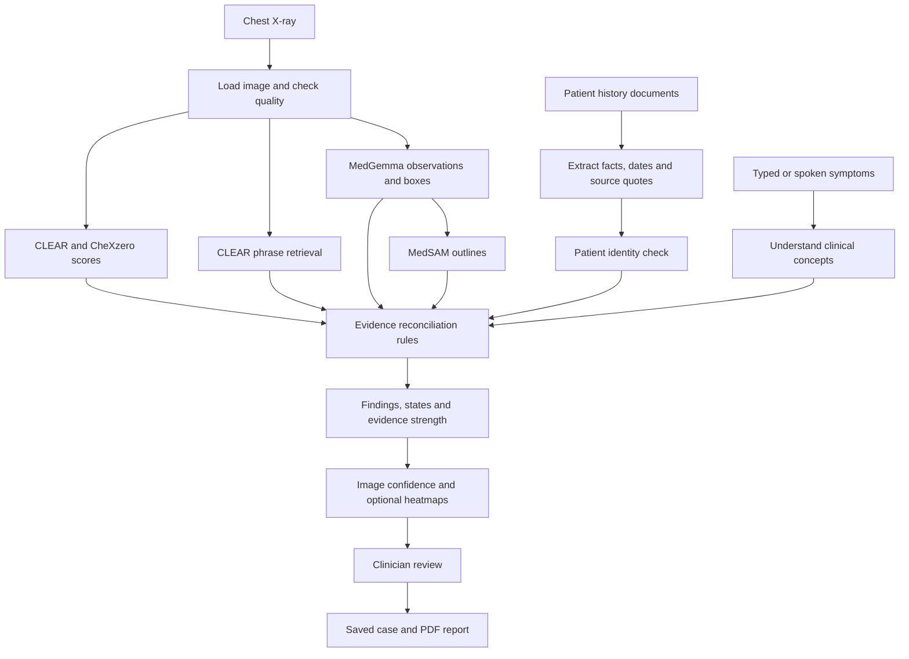

**Bonaventure takes a chest X-ray, the patient’s history, and their current symptoms, then checks whether those sources agree about possible findings.** Its main output is an evidence review that a clinician can inspect—not an automatic final diagnosis.

I read the implementation and saved results, and created a detailed [judge preparation guide](/home/ronel/Work/Bonaventure/docs/JUDGE_STUDY_GUIDE.md). It contains the full walkthrough, scoring equations, all 16 findings, limitations, a code map, and more than 40 judge questions with answers.

Here is the explanation to learn first. One version detail matters: the current code includes **image-confidence percentages and heatmaps**, while the saved demo results and audit predate those additions.

**1. Understand the problem your project solves.**

Imagine a clinician has three pieces of information:

- An X-ray that looks abnormal.
- Previous records saying the patient has heart failure.
- Current symptoms such as breathlessness and ankle swelling.

An image model can say, “This looks like pulmonary edema.” But the useful next questions are:

- Does another reader see it?
- What image evidence supports it?
- Does the patient’s history support it?
- Are their symptoms compatible?
- Is anything contradicting it?
- Is the image good enough?
- Where should the clinician look?

**Bonaventure organizes those checks and shows their evidence.**

You can introduce it to judges like this:

> “Bonaventure is a local chest-X-ray evidence assistant. It combines image-model predictions with patient records and current symptoms, identifies agreement and disagreement, shows the sources behind its conclusions, and produces a report for clinician review.”

**2. Follow the complete input-to-output journey.**



The user attaches a scan, optionally adds history documents, and types or dictates the current presentation. The application creates a case such as `BV-108`, copies the inputs into its case folder, and runs analysis in a background thread.

The main pipeline is in [pipeline.py](/home/ronel/Work/Bonaventure/bonaventure/pipeline.py).

**3. The first check is whether the image can be assessed.**

For ordinary images, the application applies orientation information and converts the image to grayscale.

For DICOM, it extracts pixel data, handles inverted grayscale when necessary, maps the image into an 8-bit intensity range, and reads available patient identifiers.

It then checks image quality using rules:

| Check | What it measures |
|---|---|
| Resolution | Whether enough pixels exist to inspect details |
| Brightness | Possible underexposure or overexposure |
| Contrast | Whether structures are distinguishable |
| Sharpness | Possible blur or heavy compression |
| Colour content | Whether the input might be a non-radiograph |

The output is **acceptable**, **limited**, or **poor**.

This is a heuristic quality check, not another AI model. Poor quality forces surviving candidate findings to **INSUFFICIENT_EVIDENCE**. Limited quality reduces evidence strength.

A judge may ask whether this proves the input is a valid chest X-ray. The answer is **no**: it does not comprehensively recognize anatomy, positioning, inspiration, rotation, or the correct view.

**4. Learn what every model actually does.**

There are four main imaging models, with additional models supporting speech and text understanding.

| Component | Job in Bonaventure | What it produces |
|---|---|---|
| **CLEAR** | Primary image–text reader | A score for each catalogue finding |
| **CheXzero** | Separately trained image reader | Another score for each finding |
| **CLEAR concept bank** | Retrieves radiology phrases resembling the film | Supporting/opposing phrases and ranks |
| **MedGemma 1.5 4B-it** | Describes observations, estimates locations, rewrites symptoms, provides a second look | Text, visibility decisions, regions and boxes |
| **MedSAM** | Refines boxes into segmented regions | Mask-derived outlines |
| **Whisper base.en** | Transcribes speech while recording | Live captions |
| **Whisper small.en** | Transcribes the completed recording | Final presentation text |
| **MiniLM** | Matches otherwise unrecognized phrases to clinical concepts | A meaning match or no match |

Here is how to explain each one.

**CLEAR converts the image and finding descriptions into comparable numerical representations.** These representations are called embeddings.

For cardiomegaly, it compares the film against:

```text
“cardiomegaly”
“no cardiomegaly”
```

If the image embedding resembles the positive phrase more strongly, the model produces a higher score.

Its image backbone is DINOv2 ViT-B/14. Bonaventure uses CLEAR’s image/text backbone and direct concept retrieval; it does not implement every part of the original CLEAR research framework. [CLEAR source](https://github.com/peterhan91/CLEAR)

**CheXzero performs a similar comparison using different pretrained weights.** It uses a CLIP ViT-B/32 checkpoint and provides another reading of the film.

Its purpose is to reveal agreement or disagreement with CLEAR. However, separately trained models can still make correlated mistakes. Agreement improves the evidence available; it does not guarantee truth. [CheXzero source](https://github.com/rajpurkarlab/CheXzero)

**The CLEAR concept bank asks, “Which radiology phrases most resemble this film?”** It contains **368,294 report-derived phrases**.

Examples include:

```text
“chronic recurrent pulmonary edema”
“no pleural effusion”
```

The system ranks these phrases by similarity to the image embedding and identifies phrases relevant to each finding.

A crucial distinction: these are **reference phrases associated with the image**, not statements from the current patient’s records. The concept bank also reuses CLEAR’s embedding, so it is not an independent additional imaging model.

**MedGemma is the generative reasoning model.** It performs five tasks:

1. Surveys the film for abnormalities, including observations outside the catalogue.
2. Describes candidate findings and whether it sees them.
3. Estimates bounding boxes.
4. Rewrites everyday presentation wording into clinical wording.
5. Looks again when a clinician challenges a finding.

For example:

```text
“sleeps propped up on pillows”
             ↓
“orthopnea, cannot lie flat”
```

Its observations can influence reconciliation, but they are checked against other evidence. In the normal full-model path, open-ended survey claims require CLEAR agreement of at least **0.85** before being marked verified.

That cutoff is an authored safeguard, not a guarantee that every accepted observation is correct. [MedGemma model card](https://huggingface.co/google/medgemma-1.5-4b-it)

**MedSAM answers a different question: “What region should be outlined inside this box?”**

It receives MedGemma’s box and predicts a segmentation mask. The application converts an accepted mask into an outline.

Remember this distinction:

> “MedGemma proposes a location. MedSAM refines the location. Neither a box nor a good-looking outline proves the diagnosis.”

MedSAM does not calculate disease probability, cancer stage, lesion volume, or severity here. [MedSAM source](https://github.com/bowang-lab/MedSAM)

**Whisper handles speech recognition.** `base.en` produces live captions; `small.en` produces the final transcript. They do not diagnose or score images. [Whisper source](https://github.com/openai/whisper)

**MiniLM provides optional meaning matching.** If rules and the clinical rewrite do not recognize a phrase, it compares that phrase with the project’s clinical concept descriptions.

It accepts a match only when:

```text
best similarity ≥ 0.40
best similarity − second-best similarity ≥ 0.08
```

These are text-similarity thresholds, not disease probabilities. [MiniLM model card](https://huggingface.co/sentence-transformers/all-MiniLM-L6-v2)

**5. Understand exactly how the images are scored.**

You must distinguish these outputs:

| Output | Meaning |
|---|---|
| Raw model score | How strongly positive wording beats negative wording |
| Weak/moderate/strong level | Which calibrated cutoffs the raw score passes |
| Concept rank | How close a supporting phrase is to the top of the phrase bank |
| Image-confidence percentage | A fitted probability estimate based on image scores |
| Evidence state | Whether the collected sources support, conflict, remain uncertain, or are insufficient |
| Evidence strength | A rule-based summary of agreement and context |

They are related, but they are not interchangeable.

**The raw score comes from image–text similarity.**

The code effectively calculates:

```text
score = sigmoid(
    scale × (
        similarity(image, positive phrase)
        − similarity(image, negative phrase)
    )
)
```

The sigmoid converts the result to a number between zero and one.

A raw score of `0.95` means the positive phrase is strongly preferred over the negative phrase by that model. **It does not automatically mean a 95% chance of disease.**

Each finding is scored separately. Scores do not sum to one across diseases, so several findings can have high values.

**The score becomes a signal level using finding-specific thresholds.**

For cardiomegaly, the saved thresholds are:

| Reader | Weak | Moderate | Strong |
|---|---:|---:|---:|
| CLEAR | 0.5076 | 0.5472 | 0.7291 |
| CheXzero | 0.1943 | 0.1943 | 0.7168 |

Therefore, CLEAR cardiomegaly score `0.9575` is strong because it exceeds `0.7291`.

A universal cutoff such as `0.5` would be inappropriate because models and findings have different score distributions.

**Those thresholds were selected using labelled images.**

The calibration script builds ROC curves and chooses operating points targeting:

- **Weak:** at least 90% sensitivity.
- **Moderate:** the best sensitivity/specificity tradeoff using Youden’s J.
- **Strong:** at least 90% specificity.

Sensitivity means catching labelled positive cases. Specificity means correctly excluding labelled negative cases.

The script sorts the selected numerical cutoffs before storing them. Those targets describe the calibration sample; they do not guarantee the same performance in another population.

The data includes **202 frontal CheXpert validation films** and a **676-film sampled NIH subset** for additional findings.

A reader normally gets a vote for a finding only if its recorded **AUROC is at least 0.70**. Pneumothorax has only seven positive CheXpert examples, so its raw-score cutoffs use manually chosen fallback values.

See [calibrate.py](/home/ronel/Work/Bonaventure/scripts/calibrate.py).

**The concept bank provides another specificity check.**

Suppose a model gives pleural effusion a high raw score, but the best supporting effusion phrase is ranked very low.

That means:

> “The positive prompt score is high, but the broader phrase retrieval does not strongly back that interpretation.”

Where concept retrieval has adequate recorded performance, this can reject the candidate or downgrade it to uncertain. Cutoffs vary by finding; “top 300” is a common gate, not the universal rule for every finding.

**6. The new percentage display uses Platt scaling.**

The current code adds a fitted transformation:

```text
logit(score) = ln(score / (1 − score))

image probability estimate =
    sigmoid(a × logit(score) + b)
```

The coefficients `a` and `b` are fitted using logistic regression on labelled films.

The application displays each voting reader’s estimate as a percentage, then averages the available reader percentages for overall image confidence.

For example, applying the current coefficients to the older Case A scores gives:

| Finding | CLEAR estimate | CheXzero estimate |
|---|---:|---:|
| Cardiomegaly | 94% | 87% |
| Pulmonary edema | 79% | 97% |
| Consolidation | 28% | 34% |

These are arithmetic examples using saved scores—not newly generated case outputs.

Notice that consolidation has a high raw score but a much lower fitted estimate. This demonstrates why raw prompt scores should not be interpreted directly as probabilities.

Your explanation should be:

> “Image confidence estimates finding presence from image scores under the calibration data distribution. Patient history and symptoms affect the evidence state separately.”

A percentage can therefore coexist with **CONFLICTING**.

Also, fitting calibration does not establish that the estimates are reliable in a hospital population. The project has not demonstrated independent probability-calibration validation, and averaging calibrated readers does not automatically yield a calibrated ensemble. [Probability calibration documentation](https://scikit-learn.org/stable/modules/calibration.html)

**7. Patient history and symptoms enter through explicit clinical mappings.**

History PDFs are processed using text extraction, followed by rules for clinical concepts, negation, and dates.

An extracted fact retains:

```text
Clinical concept
Present or negated
Date
Document name
Document type
Page
Source quote
```

For example:

```text
“No pleural effusion.”
```

becomes negative evidence rather than positive evidence.

Scanned PDFs without a text layer are not supported through OCR.

The presentation follows a layered process: original-text rules, MedGemma clinical rewriting, rules on the rewrite, and optional MiniLM fallback. Original-rule readings take precedence when a rewrite contradicts them, and disagreements are flagged.

The relationship between a concept and a finding is authored in [knowledge.py](/home/ronel/Work/Bonaventure/bonaventure/knowledge.py).

For example:

| Finding | Examples of related context |
|---|---|
| Cardiomegaly | Previous cardiomegaly, heart failure, cardiomyopathy, breathlessness, orthopnea |
| Pulmonary edema | Heart failure, kidney disease, diuretic therapy, night-time breathlessness, ankle swelling |
| Consolidation | Pneumonia history, fever, cough, productive cough, breathlessness |
| Atelectasis | Previous atelectasis, recent surgery, breathlessness |

These are simplified relevance rules. They are not learned causal relationships or a complete clinical reasoning system.

**8. The reconciliation engine decides the final state.**

It first determines which image readers are eligible to vote.

With two eligible readers, a finding can become a candidate when:

```text
at least one reader is moderate
OR
both readers are at least weak
```

With only one eligible reader, it generally needs a strong signal.

The engine then examines image agreement, MedGemma visibility, concept evidence, supporting context, opposing context, and quality.

| Situation | Typical result |
|---|---|
| Poor image quality | INSUFFICIENT_EVIDENCE |
| Image readers disagree | CONFLICTING, or UNCERTAIN if MedGemma supports one side |
| Image agreement plus enough compatible context | SUPPORTED |
| Image agreement without sufficient context | UNCERTAIN |
| Image evidence contradicts relevant history or designated denied symptoms | CONFLICTING |
| Weak image evidence without support | INSUFFICIENT_EVIDENCE |

Lines and devices have a context exception because they are hardware; the newer rules additionally require MedGemma or verified-survey visibility for that exception.

The newer code also rejects some uncertain image-only claims when no clinical context was supplied and MedGemma did not confirm them.

**SUPPORTED does not require every model to agree.** MedSAM is not a diagnostic voter, and some findings have only one eligible raw reader.

**9. Evidence strength has its own equation.**

The rule is:

```text
E = image agreement points
    + 0.5 × min(supporting context count, 3)
    − 0.5 × opposing context count
    − image-quality penalty
```

| Image agreement | Points |
|---|---:|
| Concordant, both reader levels strong | 3.0 |
| Other concordant agreement | 2.5 |
| Partial | 1.5 |
| Discordant | 1.0 |
| Weak | 0.5 |

Limited quality subtracts `0.5`.

The resulting label is:

- **High:** `E ≥ 3`, state is SUPPORTED, and supporting context exists.
- **Moderate:** `E ≥ 2`, unless the state is insufficient.
- **Low:** otherwise.

Supporting history counts distinct concepts, so repeating the same diagnosis in several documents does not repeatedly add that diagnosis’s support points.

**These constants are design choices. Evidence strength is not a probability or validated clinical score.**

The rules are in [reconcile.py](/home/ronel/Work/Bonaventure/bonaventure/reconcile.py).

**10. Work through the actual heart-failure example.**

The saved Case A includes a heart-failure film, supporting fictional history, and:

> “Worsening shortness of breath for 3 days, can't lie flat, waking up breathless at night, ankle swelling. No fever, no cough.”

For **cardiomegaly**:

```text
CLEAR:       0.9575 → strong
CheXzero:    0.9791 → strong
Support:    8
Against:    0

E = 3 + 0.5 × min(8, 3) = 4.5
```

Result: **SUPPORTED · HIGH**.

For **pulmonary edema**:

```text
CLEAR:       0.9964 → strong
CheXzero:    0.9871 → strong
Support:    9
Against:    0
Best relevant concept rank: 3
```

Result: **SUPPORTED · HIGH**.

For **consolidation**:

```text
CLEAR:       moderate
CheXzero:    strong
Support:    1
Against:    2 — fever and cough denied

E = 2.5 + 0.5 − 1 = 2.0
```

Result: **CONFLICTING · MODERATE**.

That is the project’s central mechanism:

> “Two image readers can suggest a finding, while the final output still flags conflict because the patient evidence disagrees.”

Clinically, absence of fever or cough does not exclude consolidation. The prototype’s rule flags tension; a clinician must interpret it.

The saved example is [case_A_result.json](/home/ronel/Work/Bonaventure/docs/sample_output/case_A_result.json).

**11. Understand outlines and heatmaps separately.**

An **outline** identifies a proposed region:

```text
MedGemma box → consistency checks → MedSAM contour
```

The code rejects boxes that contradict their stated side or region and rejects implausibly small or large masks. When a trustworthy box is unavailable, it can show an explicitly approximate anatomical zone.

A **heatmap** shows model sensitivity:

```text
Divide film into 8 × 8 cells.
Hide one cell.
Measure how much the reader’s signal falls.
Repeat for all 64 cells.
```

Bright cells mean hiding that region reduced the reader’s positive-versus-negative **logit** more strongly.

It uses CheXzero when available, otherwise the primary reader, and can cover up to six displayed findings.

The heatmap does not establish an exact disease boundary or change the evidence state. It can also reveal dependence on irrelevant image features.

**12. Know everything else the application produces.**

Beyond individual findings, Bonaventure provides:

| Feature | What actually happens |
|---|---|
| Patient identity warning | Extracted names/IDs are compared; mismatched document history is discarded |
| Relevant timeline | Extracted, dated history facts are displayed with sources |
| Since last report | Current findings are compared with prior **report text**, not a prior image |
| NEW / KNOWN / NOT SEEN NOW | Describes the relationship to extracted prior-report facts |
| Not-assessable advisories | Context rules can raise separate advisories for pulmonary embolism or aortic dissection |
| Also seen | Survey observations outside the reconciled findings can be displayed |
| Checked and rejected | Dropped claims are listed with reasons |
| Clinician challenge | Evidence for/against the clinician’s interpretation and an optional MedGemma second look |
| Recorded clinician verdict | Stored alongside the original output |
| PDF report | Annotated film, lung diagram, evidence, sources, review and limitations |

Three particularly important answers:

> “NOT SEEN NOW means the pipeline did not raise it today; it does not prove resolution.”

> “The pulmonary-embolism advisory is triggered by context. It is not a pulmonary-embolism prediction from the X-ray.”

> “Clinician feedback is stored. It does not automatically retrain the models.”

The advisory text mentions follow-up assessments, but the application does not implement a Wells/PERC calculator or a personalized treatment engine.

**13. Be precise about scope and accuracy.**

The catalogue contains 16 findings:

Pleural effusion, cardiomegaly, pneumothorax, consolidation, pulmonary edema, atelectasis, pneumonia, lung nodule, lung mass, emphysema, fibrosis, pleural thickening, widened mediastinum, rib fracture, hiatus hernia, and lines/devices.

**A catalogue entry does not mean reliable detection.**

The current calibration permits:

- Both raw readers for several core findings.
- CLEAR alone for pneumonia.
- CheXzero alone for pleural thickening and hernia.
- Concept-based paths for emphysema and fibrosis, requiring MedGemma and positive history.
- No reliable catalogue voter for nodules, masses, or rib fracture; some may appear through survey observations.

The saved pulmonary-edema average-score AUROC is **0.935**. Do not call this “93.5% accurate application.”

AUROC measures how well scores rank labelled positives above negatives across thresholds. It does not measure complete report correctness.

The older saved full-pipeline audit gives:

| Measure | Saved result |
|---|---:|
| Normal-labelled films | 12 |
| Normal-labelled films with any raised finding | 9 |
| Disease-labelled films | 24 |
| Target disease raised | 10 |
| Rejected claims | 193 |

These results expose substantial misses and extra candidates. They also predate the newer filtering rules, so they are not a fresh benchmark of today’s code.

NIH labels are imperfect and do not establish that every extra observation is false. Nevertheless, the audit does not support a clinical-readiness claim. Rejecting 193 claims does not prove that every rejection was correct.

Your accuracy answer should be:

> “We evaluate individual readers with per-finding AUROC and separately inspect the full pipeline. Some reader results are promising, but the saved audit shows misses and extra findings. We therefore claim an evidence-review prototype, not validated clinical diagnostic accuracy.”

See [audit.json](/home/ronel/Work/Bonaventure/bonaventure/audit.json).

**14. Explain what your team built and what it reused.**

The foundation models and their weights are external pretrained components.

Your project’s contribution is the workflow, model integration, context parsing, provenance, threshold evaluation, concept filtering, reconciliation rules, identity handling, interval comparison, clinician interaction, rejection logging, UI, and report generation.

You did not train these foundation models. **The current code does fit small logistic calibration models for image-confidence estimates.** That distinction matters.

The application uses Python with HTML/CSS/JavaScript inside a desktop webview. In the default Linux arrangement, CLEAR and CheXzero run on CPU, while MedGemma and MedSAM use CUDA. MedGemma uses 4-bit quantization to reduce GPU memory.

Inference runs locally after model setup. Inputs and outputs are saved on disk; offline operation alone does not establish comprehensive privacy compliance.

If no image reader loads, the engine can automatically switch to synthetic mock output. Check engine status before demonstrating real-model results.

**15. Practise these judge answers until you can explain the reasoning.**

| Question | Answer |
|---|---|
| Why multiple models? | To expose agreement and disagreement and inspect claims through different mechanisms; their errors can still correlate. |
| Why use patient history? | Because image appearance alone does not provide the full patient context. |
| Is this RAG? | It retrieves radiology phrases, but the project is better described as image–text retrieval plus rule-based evidence fusion. History extraction is rule-based. |
| Does MedSAM confirm disease? | No. It segments a prompted region. |
| Is the percentage final diagnostic certainty? | No. It is an image-only fitted estimate; context affects the state separately. |
| Can it predict future disease? | No. It assesses candidate current-film findings and evidence states. |
| Can it process CT/MRI? | The implemented application is scoped to frontal chest X-rays. |
| Does a doctor’s correction improve the model automatically? | No. The correction is recorded without online learning. |
| What happens with no history? | Symptoms can still provide context; without either, disease findings generally remain uncertain or insufficient. |
| What would you improve next? | Independent evaluation, stronger detection, expert-reviewed error analysis, better temporal/context rules, OCR, and validated calibration. |

**The strongest preparation is to explain why Case A’s consolidation is conflicting, why the same film changes state with different history, and why a high score or convincing outline can still be wrong.** Those explanations demonstrate understanding beyond memorizing model names.

Use the [full study guide](/home/ronel/Work/Bonaventure/docs/JUDGE_STUDY_GUIDE.md) for the detailed rules and question bank. I verified the worked arithmetic and saved audit totals, and the context, reconciliation, and model-parser self-checks passed; I did not rerun full model inference.
